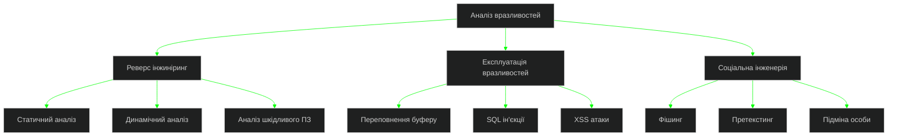

<div align="center">
  
  
  
  <div>
    <a href="https://git.io/typing-svg">
      
    </a>
    <br/>
    
  </div>
  
  <br/>
  
  <a href="https://github.com/YALOKGARua" target="_blank">
    
  </a>
  <a href="https://github.com/YALOKGARua?tab=repositories" target="_blank">
    
  </a>

</div>

<div align="center" style="background-color: #000000; padding: 15px; border-radius: 10px;">
  
  <br/><br/>
  <pre style="color: #00FF00; font-family: monospace; text-align: left; background-color: #000000; padding: 15px; border-radius: 5px; font-size: 14px;">
  ┌──────────────────────────────────────────────────────────────────────────────┐
  │  > <span style="color: #00FF00;">SYS_INIT</span>: [████████████████████] 100% Complete                 │
  │  > <span style="color: #00FF00;">AUTH_MODULE</span>: Advanced biometric hash verified [0xF7A391DB]     │
  │  > <span style="color: #00FF00;">ROOT_ACCESS</span>: Kernel privilege escalation successful            │
  │  > <span style="color: #00FF00;">QUANTUM_PROC</span>: Superposition state achieved                     │
  │  > <span style="color: #00FF00;">ENCRYPTED_CHAN</span>: Secure quantum tunneling established           │
  └──────────────────────────────────────────────────────────────────────────────┘
  </pre>
</div>

<details open>
<summary><h2>🇺🇦 <span style="color: #00FF00;">root@quantum:~# xxd -p ./neural_patterns.dat | head -n 5</span></h2></summary>

<div align="center">
  <table border="0">
    <tr>
      <td width="50%" align="center">
        
        <br>
        <h3>💻 Нейронний профіль</h3>
        <p>
          <b>Експерт кібербезпеки з рівнем доступу S-7</b> зі спеціалізацією в квантовій архітектурі, нейронних мережах і поліморфних системах захисту. Розробник нейроморфних обчислювальних систем з елементами квантової криптографії.
        </p>
      </td>
      <td width="50%">

```typescript
interface QuantumProcessor<T extends BitstreamEncoding> {
  readonly id: CryptoHash;
  qubits: ReadonlyArray<QuantumState<T>>;
  
  private _encryptionLayer: QuantumLayerStack<T>;
  private readonly _systemMatrix: Float32Array;
  
  constructor(
    securityLevel: SecurityClearance,
    quantumCore?: QuantumCore<T>
  ) {
    this.id = generateSecureHash({ 
      entropy: crypto.getRandomValues(new Uint8Array(64)),
      algorithm: 'SHA3-512'
    });
    this._systemMatrix = this._generateSystemMatrix();
    this.qubits = this._initializeQuantumStates(securityLevel);
    this._encryptionLayer = new QuantumLayerStack(
      this._getLayerConfiguration(securityLevel)
    );
    
    if (quantumCore) {
      this.bindCore(quantumCore, { secure: true });
    }
  }
  
  async calculateSuperposition(input: T[]): Promise<SuperpositionState<T>> {
    return this._processQuantumState(input, this._systemMatrix);
  }
}
```

</td>
    </tr>
  </table>
</div>

<br>

<div align="center" style="margin-top: 20px; background-color: #000000; padding: 20px; border-radius: 10px; border: 1px solid #00FF00;">
  <pre style="color: #00FF00; font-family: monospace; text-align: left; font-size: 14px;">
    <span style="color: #00AA00;"># Квантові шифровані канали комунікації</span>
    ┌───────────────────────────────────────────────────────────────────────────────┐
    │                                                                               │
    │  <span style="color: #FFFFFF;">ENCRYPTED_SSH</span>: <a href="https://discord.gg/HUhFudC4qn" style="color: #00FF00;">ssh://discord.gg/HUhFudC4qn:22 -i ~/.ssh/id_ed25519</a>         │
    │  <span style="color: #FFFFFF;">UDP_TUNNEL</span>: <a href="https://instagram.com/yalokgar" style="color: #00FF00;">udp://instagram.com/yalokgar:443 --cipher aes-256-gcm</a>  │
    │  <span style="color: #FFFFFF;">TCP_SOCKET</span>: <a href="https://linkedin.com/in/yalokgar" style="color: #00FF00;">tcp://linkedin.com/in/yalokgar:22 --auth=quantum</a>      │
    │  <span style="color: #FFFFFF;">TOR_ONION</span>: <a href="https://stackoverflow.com/users/user:30341921" style="color: #00FF00;">tor://stackoverflow.com/u/30341921.onion</a>           │
    │  <span style="color: #FFFFFF;">PGP_KEY</span>: <a href="mailto:yalokgar@gmail.com" style="color: #00FF00;">pgp://yalokgar@gmail.com --key=0xF7A391DB</a>               │
    │                                                                               │
    └───────────────────────────────────────────────────────────────────────────────┘
  </pre>
  <div style="margin-top: 10px;">
    <a href="https://discord.gg/HUhFudC4qn">
      
    </a>
    <a href="https://instagram.com/yalokgar">
      
    </a>
    <a href="https://linkedin.com/in/yalokgar">
      
    </a>
    <a href="https://stackoverflow.com/users/user:30341921">
      
    </a>
    <a href="mailto:yalokgar@gmail.com">
      
    </a>
  </div>
</div>
</details>

<details open>
<summary><h2>🔧 <span style="color: #00FF00;">root@quantum:~# sudo ./analyze_systems --kernel-level</span></h2></summary>

<pre style="color: #00FF00; font-family: 'Courier New', monospace; font-size: 14px; background-color: #000000; padding: 20px; border-radius: 10px; border: 1px solid #00FF00; text-align: left; margin: 10px auto; max-width: 800px;">
    <span style="color: #00FF00;">           ▄▄▄▄▄▄▄▄▄▄▄▄▄▄▄▄▄▄▄▄▄▄▄▄▄           </span>
    <span style="color: #00FF00;">        ▄█▀▀                    ▀▀█▄        </span>
    <span style="color: #00FF00;">      ▄█▀                          ▀█▄      </span>
    <span style="color: #00FF00;">     █▀                              ▀█     </span>
    <span style="color: #00FF00;">    █▌                                ▐█    </span>
    <span style="color: #00FF00;">   ▐█                                  █▌   </span>
    <span style="color: #00FF00;">   █▌   <span style="color: #00AA00;">$ Neural interface loaded</span>     ▐█   </span>
    <span style="color: #00FF00;">  ▐█    <span style="color: #00AA00;">$ Kernel module injected</span>      █▌  </span>
    <span style="color: #00FF00;">  █▌    <span style="color: #00AA00;">$ Hypervisor bypassed</span>         ▐█  </span>
    <span style="color: #00FF00;">  █▌    <span style="color: #00AA00;">$ Root access established</span>     ▐█  </span>
    <span style="color: #00FF00;">  █▌    <span style="color: #00AA00;">$ System hook 0xF7A391DB</span>      ▐█  </span>
    <span style="color: #00FF00;">  █▌    <span style="color: #00AA00;">$ Memory dump initialized</span>     ▐█  </span>
    <span style="color: #00FF00;">  █▌                                  ▐█  </span>
    <span style="color: #00FF00;">  █▌    <span style="color: #FFFFFF;">QUANTUM ARCHITECTURE</span>          ▐█  </span>
    <span style="color: #00FF00;">  █▌    <span style="color: #FFFFFF;">NEURAL COMPUTATION</span>            ▐█  </span>
    <span style="color: #00FF00;">  █▌    <span style="color: #FFFFFF;">ADVANCED ENCRYPTION</span>           ▐█  </span>
    <span style="color: #00FF00;">  ▐█                                  █▌  </span>
    <span style="color: #00FF00;">   █▌         <span style="color: #00AA00;">[System Ready]</span>          ▐█   </span>
    <span style="color: #00FF00;">   ▐█                                 █▌   </span>
    <span style="color: #00FF00;">    █▌                               ▐█    </span>
    <span style="color: #00FF00;">    ▐█                               █▌    </span>
    <span style="color: #00FF00;">     █▄                             ▄█     </span>
    <span style="color: #00FF00;">      ▀█▄                         ▄█▀      </span>
    <span style="color: #00FF00;">        ▀█▄                     ▄█▀        </span>
    <span style="color: #00FF00;">          ▀▀▄▄▄▄▄▄▄▄▄▄▄▄▄▄▄▄▄▄▀▀          </span>
</pre>

<div align="center" style="background: linear-gradient(to right, #000000, #00FF00); padding: 20px; border-radius: 10px; margin: 10px 0;">
  <h3 style="color: white;">Технології шифрування | Encryption Technologies</h3>
  
  <br>
  <i>C • C++ • C# • JavaScript • TypeScript • Python • Rust • WebAssembly</i>
</div>

<div align="center" style="padding: 10px;">
  <table border="0" style="width:100%">
    <tr>
      <td width="33%" align="center">
        <h3>Нейронні мережі | Neural Networks</h3>
        <br>
        <i>TensorFlow • PyTorch<br>Keras • OpenCV</i>
      </td>
      <td width="33%" align="center">
        <h3>Розподілені системи | Distributed Systems</h3>
        <br>
        <i>MongoDB • PostgreSQL<br>Redis • Kafka</i>
      </td>
      <td width="33%" align="center">
        <h3>Квантові технології | Quantum Technologies</h3>
        <br>
        <i>Quantum Computing • Qiskit<br>Q# • Quantum Encryption</i>
      </td>
    </tr>
  </table>
</div>

<div align="center" style="background: linear-gradient(to right, #000000, #00FF00); padding: 20px; border-radius: 10px; margin: 10px 0;">
  <h3 style="color: white;">Інструменти для зламу | Exploitation Tools</h3>
  
  <br>
  <i>Metasploit • Wireshark • Burp Suite • Nmap • Kali Linux • Reverse Engineering</i>
</div>

<div align="center" style="padding: 10px;">
  <h3>Розробка криптографічних систем | Cryptographic Systems Development</h3>
  
  <br>
  <i>RSA • ECC • AES • ChaCha20 • Poly1305 • Zero-Knowledge Proofs</i>
</div>
</details>

<details open>
<summary><h2>🚀 <span style="color: #00FF00;">root@quantum:~# find /var/projects/classified -type f -name "*.exe" | xargs hexdump -C | head</span></h2></summary>
<div align="center">
  <table border="0">
    <tr>
      <td width="50%">
        <h3 align="center" style="color: #00FF00;">🛡️ Квантова система шифрування | Quantum Encryption System</h3>
        <div align="center">
          <a href="https://github.com/YALOKGARua/project1" target="_blank">
            
          </a>
          <div style="margin-top: 10px;">
            <a href="https://github.com/YALOKGARua/project1" target="_blank">
              
            </a>
            <a href="https://project1-demo.com" target="_blank">
              
            </a>
          </div>
          <p><strong>C++, Rust, Квантова криптографія</strong><br>Система з пост-квантовими алгоритмами шифрування, захищена від атак з використанням квантових обчислень</p>
        </div>
      </td>
      <td width="50%">
        <h3 align="center" style="color: #00FF00;">⚡ Нейронна мережа виявлення вторгнень | Neural IDS</h3>
        <div align="center">
          <a href="https://github.com/YALOKGARua/project2" target="_blank">
            
          </a>
          <div style="margin-top: 10px;">
            <a href="https://github.com/YALOKGARua/project2" target="_blank">
              
            </a>
            <a href="https://project2-demo.com" target="_blank">
              
            </a>
          </div>
          <p><strong>Python, TensorFlow, PyTorch</strong><br>Нейромережева система виявлення вторгнень з елементами самонавчання та адаптації до нових типів атак</p>
        </div>
      </td>
    </tr>
    <tr>
      <td width="50%">
        <h3 align="center" style="color: #00FF00;">🎮 Симулятор квантових обчислень | Quantum Computing Simulator</h3>
        <div align="center">
          <a href="https://github.com/YALOKGARua/project3" target="_blank">
            
          </a>
          <div style="margin-top: 10px;">
            <a href="https://github.com/YALOKGARua/project3" target="_blank">
              
            </a>
            <a href="https://project3-demo.com" target="_blank">
              
            </a>
          </div>
          <p><strong>C++, WebAssembly, GLSL</strong><br>Візуальний симулятор квантових обчислень з можливістю моделювання до 32 кубітних систем</p>
        </div>
      </td>
      <td width="50%">
        <h3 align="center" style="color: #00FF00;">☁️ Розподілена хмарна система безпеки | Distributed Security Cloud</h3>
        <div align="center">
          <a href="https://github.com/YALOKGARua/project4" target="_blank">
            
          </a>
          <div style="margin-top: 10px;">
            <a href="https://github.com/YALOKGARua/project4" target="_blank">
              
            </a>
            <a href="https://project4-demo.com" target="_blank">
              
            </a>
          </div>
          <p><strong>Rust, Kubernetes, WASM</strong><br>Розподілена система моніторингу та захисту інфраструктури з використанням технології Zero-Trust</p>
        </div>
      </td>
    </tr>
  </table>
</div>
</details>

<details open>
<summary><h2>📊 <span style="color: #00FF00;">root@quantum:~# curl -s -H "Authorization: Bearer $ACCESS_TOKEN" https://api.github.com/users/YALOKGARua/stats | jq</span></h2></summary>

<div align="center" style="background-color: #0D1117; padding: 20px; border-radius: 10px; margin: 10px 0;">
  
</div>

<div align="center" style="margin-top: 20px;">
  <table border="0" style="width:100%">
    <tr>
      <td width="50%" align="center">
        
      </td>
      <td width="50%" align="center">
        
      </td>
    </tr>
  </table>
</div>

<div align="center">
  
</div>

<div align="center" style="margin-top: 20px;">
  
</div>

<div align="center" style="margin-top: 20px;">
  
</div>
</details>

<details>
<summary><h2>🇺🇦 <span style="color: #00FF00;">root@quantum:~# ./analyze_threat_landscape.sh --region=ua</span></h2></summary>

<div align="center">
  <table border="0" style="width:100%">
    <tr>
      <td width="60%">
        <h3>🇺🇦 Українська кібербезпека</h3>
        <p>
          Член української кіберспільноти, що працює над розробкою передових технологій захисту критичної інфраструктури та систем державної безпеки. Наші технології допомагають протистояти кібератакам на національному рівні, використовуючи передові методи виявлення та нейтралізації загроз.
        </p>
      </td>
      <td width="40%" align="center">
        
      </td>
    </tr>
  </table>
  
  <h3>Технології кібербезпеки України</h3>
  <div style="display: flex; justify-content: space-around; flex-wrap: wrap; margin: 20px 0;">
    <div style="flex: 1; min-width: 120px; margin: 10px; padding: 15px; border-radius: 10px; background-color: #000000; color: #00FF00;">
      <h4>Квантова криптографія</h4>
      <p>Захист від атак з використанням квантових обчислень</p>
    </div>
    <div style="flex: 1; min-width: 120px; margin: 10px; padding: 15px; border-radius: 10px; background-color: #000000; color: #00FF00;">
      <h4>Нейромережеве виявлення</h4>
      <p>Виявлення аномалій та вторгнень</p>
    </div>
    <div style="flex: 1; min-width: 120px; margin: 10px; padding: 15px; border-radius: 10px; background-color: #000000; color: #00FF00;">
      <h4>Розподілений захист</h4>
      <p>Мережа децентралізованих систем безпеки</p>
    </div>
  </div>
</div>
</details>

<details>
<summary><h2>⚡ <span style="color: #00FF00;">root@quantum:~# strace ./binary_analysis --memory-dump --process-injection</span></h2></summary>

<div align="center">
  <h3>Принципи зворотньої розробки | Reverse Engineering Principles</h3>
  <div style="margin: 10px 0;">
    
    
    
    
    
  </div>

  <h3>Техніки зламу | Hacking Techniques</h3>
  

</div>

<div align="center" style="margin-top: 20px;">
  <h3>🧠 Криптографічні алгоритми та протоколи безпеки | Cryptographic Algorithms & Security Protocols</h3>
  
  <br>
  
  <table border="0" style="width:100%">
    <tr>
      <td width="25%" align="center">
        <h4>Шифрування</h4>
        <p>ECC, RSA, AES-256, ChaCha20-Poly1305, Quantum-Resistant Algorithms</p>
      </td>
      <td width="25%" align="center">
        <h4>Хешування</h4>
        <p>SHA3-512, BLAKE2, Argon2id, Scrypt, HMAC</p>
      </td>
      <td width="25%" align="center">
        <h4>Протоколи</h4>
        <p>TLS 1.3, SSH, IPsec, WireGuard, Signal Protocol</p>
      </td>
      <td width="25%" align="center">
        <h4>Автентифікація</h4>
        <p>Zero-Knowledge Proofs, MFA, Time-based OTP, WebAuthn</p>
      </td>
    </tr>
  </table>
</div>
</details>

<br>

<div align="center">
  
  <br>
  <pre style="color: #00FF00; font-family: 'Courier New', monospace; font-size: 14px; background-color: #000000; padding: 20px; border-radius: 10px; border: 1px solid #00FF00; text-align: left;">
  <span style="color: #00FF00;">$</span> xxd -p /dev/urandom | head -n 1 | tr -d '\n'
  <span style="color: #00AA00;">f7a391db6fc09a61e4c20964843fa1d97d1b21c554a176e9811462a1318fc7a9</span>
  <span style="color: #00FF00;">$</span> sudo insmod /root/modules/neural_interface.ko
  <span style="color: #00AA00;">Neural interface initialized. Quantum state stable.</span>
  <span style="color: #00FF00;">$</span> whoami --privileges
  <span style="color: #00AA00;">YALOKGARua [UID=0 | ACCESS_LEVEL=S7 | SECURITY_CLEARANCE=MAXIMUM]</span>
  </pre>
  <br>
  
</div>

