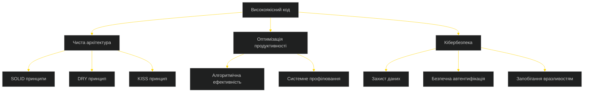

<div align="center">
  
  
  
  <div>
    <a href="https://git.io/typing-svg">
      
    </a>
    <br/>
    
  </div>
  
  <br/>
  
  <a href="https://github.com/YALOKGARua" target="_blank">
    
  </a>
  <a href="https://github.com/YALOKGARua?tab=repositories" target="_blank">
    
  </a>

</div>

<div align="center">
  
  <br/><br/>
  
</div>

<details open>
<summary><h2>🇺🇦 Про мене | About Me</h2></summary>

<div align="center">
  <table border="0">
    <tr>
      <td width="50%" align="center">
        
        <br>
        <h3>💻 Професійний досвід</h3>
        <p>
          <b>Senior Software Engineer</b> з глибокими знаннями архітектури систем, оптимізації продуктивності та безпеки. Створюю масштабовані рішення з елегантним та ефективним кодом.
        </p>
      </td>
      <td width="50%">

```typescript
class UkrainianDeveloper {
  name: string = "YALOKGARua";
  location: string = "Ukraine 🇺🇦";
  languages: Record<string, string> = {
    code: ["TypeScript", "Rust", "Python", "C++", "C#"],
    spoken: ["Ukrainian", "English", "Russian"]
  };
  
  architecture: string[] = [
    "Microservices", "Event-Driven",
    "Serverless", "High-Load Systems"
  ];
  
  currentChallenges: string[] = [
    "Building resilient distributed systems",
    "Optimization algorithms for complex data",
    "Advanced security implementations"
  ];
  
  sayHello(): string {
    return "Слава Україні! Welcome to my profile!";
  }
}
```

</td>
    </tr>
  </table>
</div>

<br>

<div align="center" style="margin-top: 20px;">
  <a href="https://discord.gg/HUhFudC4qn">
    
  </a>
  <a href="https://instagram.com/yalokgar">
    
  </a>
  <a href="https://linkedin.com/in/yalokgar">
    
  </a>
  <a href="https://stackoverflow.com/users/user:30341921">
    
  </a>
  <a href="mailto:yalokgar@gmail.com">
    
  </a>
</div>
</details>

<details open>
<summary><h2>🔧 Технічний арсенал | Tech Stack</h2></summary>

<div align="center" style="background: linear-gradient(to right, #0057B8, #FFD700); padding: 20px; border-radius: 10px; margin: 10px 0;">
  <h3 style="color: white;">Мови програмування | Programming Languages</h3>
  
  <br>
  <i>C • C++ • C# • JavaScript • TypeScript • Python • Rust • Lua • Ruby • HTML • CSS • WebAssembly</i>
</div>

<div align="center" style="padding: 10px;">
  <table border="0" style="width:100%">
    <tr>
      <td width="33%" align="center">
        <h3>Фреймворки | Frameworks</h3>
        <br>
        <i>.NET • Node.js • React<br>Vue • Angular • Express</i>
      </td>
      <td width="33%" align="center">
        <h3>Бази даних | Databases</h3>
        <br>
        <i>MySQL • PostgreSQL • MongoDB<br>Redis • Firebase • SQLite</i>
      </td>
      <td width="33%" align="center">
        <h3>DevOps & Cloud</h3>
        <br>
        <i>AWS • Azure • Docker<br>Kubernetes • GitHub Actions • Jenkins</i>
      </td>
    </tr>
  </table>
</div>

<div align="center" style="background: linear-gradient(to right, #0057B8, #FFD700); padding: 20px; border-radius: 10px; margin: 10px 0;">
  <h3 style="color: white;">Інструменти розробки | Development Tools</h3>
  
  <br>
  <i>Git • GitHub • GitLab • VS Code • Visual Studio • Figma • Vim • CMake • Bash • PowerShell</i>
</div>

<div align="center" style="padding: 10px;">
  <h3>Ігрова розробка | Game Development</h3>
  
  <br>
  <i>Unity • Unreal Engine • Godot • Blender</i>
</div>
</details>

<details open>
<summary><h2>🚀 Видатні проекти | Featured Projects</h2></summary>
<div align="center">
  <table border="0">
    <tr>
      <td width="50%">
        <h3 align="center" style="color: #0057B8;">🛡️ Security System</h3>
        <div align="center">
          <a href="https://github.com/YALOKGARua/project1" target="_blank">
            
          </a>
          <div style="margin-top: 10px;">
            <a href="https://github.com/YALOKGARua/project1" target="_blank">
              
            </a>
            <a href="https://project1-demo.com" target="_blank">
              
            </a>
          </div>
          <p><strong>C++, Rust, Cryptography</strong><br>Advanced security system with multi-layer encryption and real-time threat detection</p>
        </div>
      </td>
      <td width="50%">
        <h3 align="center" style="color: #0057B8;">⚡ High-Load API</h3>
        <div align="center">
          <a href="https://github.com/YALOKGARua/project2" target="_blank">
            
          </a>
          <div style="margin-top: 10px;">
            <a href="https://github.com/YALOKGARua/project2" target="_blank">
              
            </a>
            <a href="https://project2-demo.com" target="_blank">
              
            </a>
          </div>
          <p><strong>TypeScript, Node.js, Redis</strong><br>Highly scalable API handling 10,000+ requests per second with advanced caching system</p>
        </div>
      </td>
    </tr>
    <tr>
      <td width="50%">
        <h3 align="center" style="color: #0057B8;">🎮 Game Engine</h3>
        <div align="center">
          <a href="https://github.com/YALOKGARua/project3" target="_blank">
            
          </a>
          <div style="margin-top: 10px;">
            <a href="https://github.com/YALOKGARua/project3" target="_blank">
              
            </a>
            <a href="https://project3-demo.com" target="_blank">
              
            </a>
          </div>
          <p><strong>C++, OpenGL, GLSL</strong><br>Custom game engine featuring advanced physics, procedural generation and realistic rendering</p>
        </div>
      </td>
      <td width="50%">
        <h3 align="center" style="color: #0057B8;">☁️ Cloud Solution</h3>
        <div align="center">
          <a href="https://github.com/YALOKGARua/project4" target="_blank">
            
          </a>
          <div style="margin-top: 10px;">
            <a href="https://github.com/YALOKGARua/project4" target="_blank">
              
            </a>
            <a href="https://project4-demo.com" target="_blank">
              
            </a>
          </div>
          <p><strong>C#, .NET, Azure, Kubernetes</strong><br>Enterprise-grade cloud infrastructure with auto-scaling, intelligent load balancing and disaster recovery</p>
        </div>
      </td>
    </tr>
  </table>
</div>
</details>

<details open>
<summary><h2>📊 GitHub статистика | GitHub Stats</h2></summary>

<div align="center" style="background-color: #0D1117; padding: 20px; border-radius: 10px; margin: 10px 0;">
  
</div>

<div align="center" style="margin-top: 20px;">
  <table border="0" style="width:100%">
    <tr>
      <td width="50%" align="center">
        
      </td>
      <td width="50%" align="center">
        
      </td>
    </tr>
  </table>
</div>

<div align="center">
  
</div>

<div align="center" style="margin-top: 20px;">
  
</div>

<div align="center" style="margin-top: 20px;">
  
</div>
</details>

<details>
<summary><h2>💙💛 Українські технології | Ukrainian Tech</h2></summary>

<div align="center">
  <table border="0" style="width:100%">
    <tr>
      <td width="60%">
        <h3>🇺🇦 Українська IT-спільнота</h3>
        <p>
          Гордий бути частиною української IT-спільноти, що зробила значний внесок у світовий розвиток технологій. Українські розробники відомі своєю креативністю, технічною досконалістю та інноваційним підходом до рішення складних проблем.
        </p>
      </td>
      <td width="40%" align="center">
        
      </td>
    </tr>
  </table>
  
  <h3>Українські технологічні досягнення</h3>
  <div style="display: flex; justify-content: space-around; flex-wrap: wrap; margin: 20px 0;">
    <div style="flex: 1; min-width: 120px; margin: 10px; padding: 15px; border-radius: 10px; background-color: #0057B8; color: #FFD700;">
      <h4>Grammarly</h4>
      <p>Революційний інструмент перевірки граматики</p>
    </div>
    <div style="flex: 1; min-width: 120px; margin: 10px; padding: 15px; border-radius: 10px; background-color: #0057B8; color: #FFD700;">
      <h4>GitLab</h4>
      <p>Співзасновник українського походження</p>
    </div>
    <div style="flex: 1; min-width: 120px; margin: 10px; padding: 15px; border-radius: 10px; background-color: #0057B8; color: #FFD700;">
      <h4>Readdle</h4>
      <p>Продуктивні додатки для iOS</p>
    </div>
    <div style="flex: 1; min-width: 120px; margin: 10px; padding: 15px; border-radius: 10px; background-color: #0057B8; color: #FFD700;">
      <h4>MacPaw</h4>
      <p>Інноваційне програмне забезпечення для macOS</p>
    </div>
  </div>
</div>
</details>

<details>
<summary><h2>⚡ Методології та інструменти | Methodologies & Tools</h2></summary>

<div align="center">
  <h3>Методології розробки | Development Methodologies</h3>
  <div style="margin: 10px 0;">
    
    
    
    
    
    
  </div>

  <h3>Принципи розробки | Development Principles</h3>
  

```mermaid
%%{init: {'theme': 'dark', 'themeVariables': { 'primaryColor': '#0057B8', 'primaryTextColor': '#FFD700', 'primaryBorderColor': '#FFD700', 'lineColor': '#FFD700', 'secondaryColor': '#0057B8', 'tertiaryColor': '#0057B8'}}}%%
graph TD
    A[Високоякісний код] --> B[Чиста архітектура]
    A --> C[Оптимізація продуктивності]
    A --> D[Кібербезпека]
    
    B --> E[SOLID принципи]
    B --> F[DRY принцип]
    B --> G[KISS принцип]
    
    C --> H[Алгоритмічна ефективність]
    C --> I[Системне профілювання]
    
    D --> J[Захист даних]
    D --> K[Безпечна автентифікація]
    D --> L[Запобігання вразливостям]
```
</div>

<div align="center" style="margin-top: 20px;">
  <h3>🧠 Технічний стек та експертиза | Tech Stack & Expertise</h3>
  
  <br>
  
  <table border="0" style="width:100%">
    <tr>
      <td width="25%" align="center">
        <h4>Backend</h4>
        <p>Microservices, RESTful APIs, GraphQL, GRPC, WebSockets</p>
      </td>
      <td width="25%" align="center">
        <h4>Frontend</h4>
        <p>React, Vue, Angular, Next.js, Redux, WebGL, Electron</p>
      </td>
      <td width="25%" align="center">
        <h4>DevOps</h4>
        <p>CI/CD, Infrastructure as Code, Kubernetes, Docker, Terraform</p>
      </td>
      <td width="25%" align="center">
        <h4>Security</h4>
        <p>Auth, Encryption, Penetration Testing, Secure Coding Practices</p>
      </td>
    </tr>
  </table>
</div>
</details>

<br>

<div align="center">
  
  <br>
  
  <br>
  
</div>

