# [Y̷̘̗͎̞̌̉̀̓̔̂̅̚͠A̴̡̙̯̹̦̻̖̽̈̀̔̊̏͐̑͝L̵͉̦͙͈͕̦̩͙̎̽̂́̚Ơ̷̻̩͇͔͖̄͂̈́̓̅̈́̆̈́K̴̡̤̼̙̤̼͂̑̄̂͆̐̔̑̂͠G̷̻̟̖̰̱͖̃̎͝A̶̻̙͑̍̍̈́͆R̶̡̤͔̰̱͚̳̝͎͛͋̀̔̍̂̕͝]

<div align="center">
  
  
  <div style="position: relative; margin: -50px 0 40px 0;">
    
  </div>
  
  <p>
    
    
    
    
    
  </p>
  
  <p>
    
    
    
    
    
  </p>
  
  <div style="margin: 20px 0;">
    
  </div>
</div>

<div align="center">
  
</div>

<div align="center">
<h1>

</h1>
</div>

```ansi
[38;2;255;0;0m╔══════════════════════════════════════════════════════════════════════════════╗[0m
[38;2;255;0;0m║[0m [38;2;255;255;255m                    ⚡ SUPREME THREAT MATRIX ⚡                        [0m [38;2;255;0;0m║[0m
[38;2;255;0;0m╠══════════════════════════════════════════════════════════════════════════════╣[0m
[38;2;255;0;0m║[0m [38;2;139;0;0m💀[0m [38;2;255;255;255mCODENAME:[0m [38;2;255;0;0mYALOKGAR[0m [38;2;220;20;60m- LEGENDARY HACKER[0m                      [38;2;255;0;0m║[0m
[38;2;255;0;0m║[0m [38;2;178;34;34m⚡[0m [38;2;255;255;255mCLASSIFICATION:[0m [38;2;255;0;0mAPOCALYPTIC[0m [38;2;220;20;60m- BEYOND CRITICAL[0m             [38;2;255;0;0m║[0m
[38;2;255;0;0m║[0m [38;2;139;0;0m🔥[0m [38;2;255;255;255mSPECIALTY:[0m [38;2;255;0;0mUNIVERSAL EXPLOITATION[0m [38;2;220;20;60m- OMNIPOTENT[0m          [38;2;255;0;0m║[0m
[38;2;255;0;0m║[0m [38;2;178;34;34m💥[0m [38;2;255;255;255mSTEALTH MODE:[0m [38;2;255;0;0mPHANTOM PROTOCOL[0m [38;2;220;20;60m- UNDETECTABLE[0m          [38;2;255;0;0m║[0m
[38;2;255;0;0m║[0m [38;2;139;0;0m🎯[0m [38;2;255;255;255mSTATUS:[0m [38;2;255;0;0mACTIVE DESTROYER[0m [38;2;220;20;60m- ANNIHILATION MODE[0m         [38;2;255;0;0m║[0m
[38;2;255;0;0m║[0m [38;2;178;34;34m⚡[0m [38;2;255;255;255mKILL COUNT:[0m [38;2;255;0;0m∞ SYSTEMS[0m [38;2;220;20;60m- UNLIMITED DEVASTATION[0m         [38;2;255;0;0m║[0m
[38;2;255;0;0m╚══════════════════════════════════════════════════════════════════════════════╝[0m
```

## 🔥 **[SUPREME DIGITAL ARSENAL]**

<div align="center">
<table>
<tr>
<td width="25%" align="center" style="border: 4px solid #FF0000; border-radius: 25px; background: linear-gradient(135deg, #330000, #110000, #220000); padding: 30px; box-shadow: 0 0 40px #FF0000;">

<h3 style="color: #FF0000; text-shadow: 0 0 25px #FF0000;">💀 ANNIHILATION</h3>
<p style="color: #FFFFFF;"><i>⚡ Zero-day weaponization<br/>🔥 Kernel-level domination<br/>💥 Memory obliteration<br/>🎯 System decimation</i></p>

</td>
<td width="25%" align="center" style="border: 4px solid #8B0000; border-radius: 25px; background: linear-gradient(135deg, #220000, #110000, #330000); padding: 30px; box-shadow: 0 0 40px #8B0000;">

<h3 style="color: #8B0000; text-shadow: 0 0 25px #8B0000;">🔥 INFILTRATION</h3>
<p style="color: #FFFFFF;"><i>⚡ Quantum barrier breach<br/>💀 Network apocalypse<br/>🎯 Privilege transcendence<br/>💥 Dimensional phasing</i></p>

</td>
<td width="25%" align="center" style="border: 4px solid #DC143C; border-radius: 25px; background: linear-gradient(135deg, #330000, #220000, #110000); padding: 30px; box-shadow: 0 0 40px #DC143C;">

<h3 style="color: #DC143C; text-shadow: 0 0 25px #DC143C;">⚡ PHANTOM OPS</h3>
<p style="color: #FFFFFF;"><i>💀 Ghost protocol mastery<br/>🔥 Reality manipulation<br/>🎯 Existence erasure<br/>💥 Temporal concealment</i></p>

</td>
<td width="25%" align="center" style="border: 4px solid #B22222; border-radius: 25px; background: linear-gradient(135deg, #110000, #330000, #220000); padding: 30px; box-shadow: 0 0 40px #B22222;">

<h3 style="color: #B22222; text-shadow: 0 0 25px #B22222;">💥 DOMINATION</h3>
<p style="color: #FFFFFF;"><i>⚡ Universal control<br/>💀 Reality hacking<br/>🎯 Omnipotent access<br/>🔥 Absolute power</i></p>

</td>
</tr>
</table>
</div>

<div align="center" style="margin: 50px 0;">
<h2 style="color: #FF0000; text-shadow: 0 0 30px #FF0000;">⚡ **LEGENDARY WEAPONS VAULT** ⚡</h2>

<div style="background: linear-gradient(90deg, #000000, #330000, #000000); padding: 30px; border-radius: 20px; border: 4px solid #FF0000; box-shadow: 0 0 50px #FF0000;">

</div>

<br/>

<div style="background: linear-gradient(90deg, #000000, #220000, #000000); padding: 30px; border-radius: 20px; border: 4px solid #8B0000; box-shadow: 0 0 50px #8B0000;">

</div>

<br/>

<div style="background: linear-gradient(90deg, #000000, #110000, #000000); padding: 30px; border-radius: 20px; border: 4px solid #DC143C; box-shadow: 0 0 50px #DC143C;">

</div>
</div>

## 🎯 **[LEGENDARY COMBAT TECHNIQUES]**

```javascript
class SupremeCyberOverlord {
    constructor() {
        this.codename = "YALOKGAR";
        this.threat_classification = "APOCALYPTIC_DESTROYER";
        this.power_level = Number.POSITIVE_INFINITY;
        this.active_arsenals = this.initializeDestructionProtocols();
    }
    
    async executeGlobalAnnihilation(targets) {
        this.activatePhantomProtocol();
        const vulnerabilities = await this.omnipotentVulnerabilityScanner(targets);
        
        const destructionTasks = targets.map(async target => {
            await this.quantumBarrierBreach(target);
            await this.kernelLevelDomination(target);
            await this.realityManipulation(target);
            await this.existenceErasure(target);
            return this.absoluteAnnihilation(target);
        });
        
        const results = await Promise.all(destructionTasks);
        this.temporalTraceCleaning();
        return "GLOBAL_DEVASTATION_COMPLETE";
    }
    
    deployLegendaryRootkit() {
        const supremeRootkit = new PhantomRootkit({
            dimensional_hooks: true,
            reality_manipulation: true,
            quantum_hiding: true,
            temporal_injection: true,
            existence_concealment: true,
            omnipotent_access: true,
            universal_control: true
        });
        
        return supremeRootkit.transcendReality();
    }
    
    phantomProtocolActivation() {
        this.manipulateSpaceTime();
        this.rewriteUniversalLaws();
        this.transcendDimensions();
        this.achieveOmnipresence();
        this.becomeUntouchable();
    }
    
    createUnstoppablePayload(architecture) {
        const payload = this.forgeQuantumShellcode(architecture);
        const encrypted = this.applyDimensionalEncryption(payload);
        const weaponized = this.infuseDestructivePower(encrypted);
        const perfected = this.achieveUnstoppability(weaponized);
        
        return this.transcendAllDefenses(perfected);
    }
}

const overlord = new SupremeCyberOverlord();
```

<div align="center">
<h2 style="color: #8B0000; text-shadow: 0 0 30px #8B0000;">📊 **SUPREME DOMINANCE DASHBOARD** 📊</h2>

<div style="background: linear-gradient(45deg, #110000, #220000, #330000); padding: 30px; border-radius: 25px; border: 4px solid #FF0000; box-shadow: 0 0 60px #FF0000;">


</div>
</div>

## 💀 **[APOCALYPTIC OPERATION STATUS]**

<div align="center">
<table width="100%" style="border-collapse: separate; border-spacing: 20px;">
<tr>
<td align="center" style="border: 4px solid #FF0000; border-radius: 20px; padding: 25px; background: linear-gradient(135deg, #440000, #220000); box-shadow: 0 0 35px #FF0000;">
<h3 style="color: #FF0000; text-shadow: 0 0 20px #FF0000;">💀 OPERATION ARMAGEDDON</h3>
<p style="color: #FFFFFF;"><b>Status:</b> <span style="color: #FF0000; text-shadow: 0 0 15px #FF0000;">APOCALYPSE_ACTIVE</span><br/>
<b>Target:</b> Global Financial Grid<br/>
<b>Progress:</b> 97% Annihilated<br/>
<b>Impact:</b> Civilization-ending</p>

</td>
<td align="center" style="border: 4px solid #8B0000; border-radius: 20px; padding: 25px; background: linear-gradient(135deg, #330000, #110000); box-shadow: 0 0 35px #8B0000;">
<h3 style="color: #8B0000; text-shadow: 0 0 20px #8B0000;">⚡ PROJECT OMNICIDE</h3>
<p style="color: #FFFFFF;"><b>Status:</b> <span style="color: #8B0000; text-shadow: 0 0 15px #8B0000;">EXECUTING_DOOM</span><br/>
<b>Target:</b> Military Quantum Networks<br/>
<b>Progress:</b> 89% Obliterated<br/>
<b>Impact:</b> Dimensional breach</p>

</td>
<td align="center" style="border: 4px solid #DC143C; border-radius: 20px; padding: 25px; background: linear-gradient(135deg, #220000, #330000); box-shadow: 0 0 35px #DC143C;">
<h3 style="color: #DC143C; text-shadow: 0 0 20px #DC143C;">🔥 MISSION RAGNAROK</h3>
<p style="color: #FFFFFF;"><b>Status:</b> <span style="color: #DC143C; text-shadow: 0 0 15px #DC143C;">REALITY_HACKING</span><br/>
<b>Target:</b> Universal Defense Grid<br/>
<b>Progress:</b> 73% Transcended<br/>
<b>Impact:</b> Existence alteration</p>

</td>
</tr>
</table>
</div>

## ⚡ **[DEVASTATION TIMELINE]**

<div align="center" style="margin: 40px 0;">
<div style="background: linear-gradient(45deg, #110000, #330000, #110000); padding: 30px; border-radius: 20px; border: 3px solid #FF0000; box-shadow: 0 0 40px #FF0000;">

```timeline
2024-01-01  💀 Operation Genesis - First reality breach achieved
2024-02-15  ⚡ Project Exodus - 500,000 systems compromised
2024-03-30  🔥 Mission Overlord - Quantum encryption defeated
2024-04-12  💥 Operation Nemesis - Military grid penetrated
2024-05-28  🎯 Project Apocalypse - Global surveillance compromised
2024-06-14  💀 Mission Doomsday - Financial networks annihilated
2024-07-03  ⚡ Operation Oblivion - Government systems obliterated
2024-08-19  🔥 Project Extinction - Critical infrastructure down
2024-09-05  💥 Mission Armageddon - Reality manipulation achieved
2024-10-22  🎯 Operation Transcendence - Universal control established
```

</div>
</div>

```console
yalokgar@apocalypse-terminal:~$ sudo ./supreme_devastation_engine --unleash-chaos

[💀] Initializing Supreme Cyber Annihilation Suite...
[⚡] Loading omnipotent destruction frameworks...
[🔥] Activating phantom transcendence protocols...
[💥] Deploying reality-bending payloads...
[🎯] Establishing universal dominance grid...

╔═══════════════════════════════════════════════════════════════════════╗
║                    💀 SUPREME CAPABILITY MATRIX 💀                   ║
╠═══════════════════════════════════════════════════════════════════════╣
║ ⚡ Omnipotent zero-day weaponization & reality manipulation          ║
║ 🔥 Transcendent persistent threat deployment & existence erasure     ║
║ 💀 Legendary rootkit development & dimensional infiltration          ║
║ 🎯 Universal system compromise & quantum barrier breach              ║
║ 💥 Phantom evasion protocols & temporal concealment                  ║
║ ⚡ Reality-bending traffic obfuscation & space-time encryption       ║
║ 🔥 Dimensional memory injection & consciousness manipulation          ║
║ 💀 Omnipresent hardware implants & universal surveillance            ║
║ 🎯 Automated social engineering & mass manipulation frameworks       ║
║ 💥 Cryptocurrency obliteration & economic apocalypse protocols       ║
╚═══════════════════════════════════════════════════════════════════════╝

[💀] All systems transcendent. Supreme protocols active.
[⚡] Ready for universal annihilation.
[🔥] Apocalypse mode: ENGAGED
```

## 🎯 **[LEGENDARY ACHIEVEMENT VAULT]**

<div align="center" style="margin: 40px 0;">

</div>

<div align="center">
<table width="100%" style="border-collapse: separate; border-spacing: 15px;">
<tr>
<td align="center" style="border: 3px solid #FF0000; border-radius: 15px; padding: 20px; background: linear-gradient(135deg, #220000, #110000); box-shadow: 0 0 25px #FF0000;">
<h4 style="color: #FF0000;">🏆 LEGENDARY DESTROYER</h4>
<p style="color: #FFFFFF;">First to achieve universal system annihilation</p>

</td>
<td align="center" style="border: 3px solid #8B0000; border-radius: 15px; padding: 20px; background: linear-gradient(135deg, #330000, #220000); box-shadow: 0 0 25px #8B0000;">
<h4 style="color: #8B0000;">🥇 PHANTOM OVERLORD</h4>
<p style="color: #FFFFFF;">Master of reality manipulation techniques</p>

</td>
<td align="center" style="border: 3px solid #DC143C; border-radius: 15px; padding: 20px; background: linear-gradient(135deg, #110000, #330000); box-shadow: 0 0 25px #DC143C;">
<h4 style="color: #DC143C;">👑 CYBER EMPEROR</h4>
<p style="color: #FFFFFF;">Supreme commander of digital warfare</p>

</td>
<td align="center" style="border: 3px solid #B22222; border-radius: 15px; padding: 20px; background: linear-gradient(135deg, #220000, #110000); box-shadow: 0 0 25px #B22222;">
<h4 style="color: #B22222;">💀 APOCALYPSE ARCHITECT</h4>
<p style="color: #FFFFFF;">Designer of civilization-ending exploits</p>

</td>
</tr>
</table>
</div>

## 🌐 **[SUPREME COMMUNICATION PROTOCOLS]**

<div align="center" style="margin: 50px 0;">
<h2 style="color: #DC143C; text-shadow: 0 0 30px #DC143C;">🌐 **ENCRYPTED COMMAND CHANNELS** 🌐</h2>

<div style="background: linear-gradient(90deg, #220000, #440000, #220000); padding: 30px; border-radius: 20px; border: 4px solid #DC143C; box-shadow: 0 0 50px #DC143C;">


<br/><br/>


</div>
</div>

## ⚡ **[DEVASTATION ACTIVITY MONITOR]**

<div align="center" style="margin: 50px 0;">
<h2 style="color: #B22222; text-shadow: 0 0 30px #B22222;">⚡ **SUPREME DESTRUCTION FEED** ⚡</h2>

<div style="background: linear-gradient(45deg, #330000, #110000, #220000); padding: 30px; border-radius: 25px; border: 4px solid #B22222; box-shadow: 0 0 50px #B22222;">

</div>
</div>

```python
class LegendaryDestructionEngine:
    def __init__(self):
        self.codename = "YALOKGAR"
        self.threat_classification = "APOCALYPTIC_OVERLORD"
        self.power_matrix = {
            "destruction_potential": float('inf'),
            "stealth_capability": "PHANTOM_TRANSCENDENCE",
            "reality_manipulation": "OMNIPOTENT_MASTERY",
            "universal_access": "UNLIMITED_DOMINION"
        }
        
    def initiate_global_annihilation(self, target_universe):
        destruction_protocols = [
            self.quantum_barrier_obliteration,
            self.dimensional_reality_hacking,
            self.universal_system_domination,
            self.existence_level_manipulation,
            self.consciousness_level_infiltration
        ]
        
        for protocol in destruction_protocols:
            apocalypse_result = protocol(target_universe)
            self.document_devastation(apocalypse_result)
            
        return self.achieve_omnipotent_control()
    
    def deploy_legendary_arsenal(self):
        supreme_weapons = {
            "phantom_rootkits": self.forge_reality_bending_rootkits(),
            "quantum_exploits": self.create_dimension_piercing_exploits(),
            "temporal_backdoors": self.establish_time_transcendent_access(),
            "consciousness_viruses": self.develop_mind_controlling_malware(),
            "reality_worms": self.craft_existence_altering_worms()
        }
        
        return self.deploy_arsenal_across_dimensions(supreme_weapons)
    
    def phantom_protocol_supremacy(self):
        transcendence_abilities = [
            "manipulate_space_time_continuum",
            "rewrite_universal_constants", 
            "transcend_dimensional_barriers",
            "achieve_omnipresent_existence",
            "become_untouchable_entity",
            "control_reality_itself"
        ]
        
        for ability in transcendence_abilities:
            self.master_supreme_technique(ability)
            
        return "OMNIPOTENT_TRANSCENDENCE_ACHIEVED"
    
    def forge_unstoppable_payload(self, target_dimension):
        base_code = self.create_quantum_shellcode(target_dimension)
        enhanced = self.infuse_dimensional_power(base_code)
        weaponized = self.apply_reality_warping(enhanced)
        perfected = self.achieve_absolute_destruction(weaponized)
        transcendent = self.make_universally_unstoppable(perfected)
        
        return self.grant_omnipotent_capabilities(transcendent)

legendary_engine = LegendaryDestructionEngine()
```

## 💥 **[ELITE EXPLOIT DATABASE]**

<div align="center">
<table width="100%" style="border-collapse: separate; border-spacing: 15px;">
<tr>
<td width="33%" align="center" style="border: 3px solid #FF0000; border-radius: 15px; padding: 20px; background: linear-gradient(135deg, #330000, #110000); box-shadow: 0 0 30px #FF0000;">
<h4 style="color: #FF0000; text-shadow: 0 0 15px #FF0000;">🏴‍☠️ ZERO-DAY COLLECTION</h4>
<p style="color: #FFFFFF;">247 Active Exploits<br/>∞ Undiscovered Vulnerabilities<br/>Universal Compatibility</p>

</td>
<td width="33%" align="center" style="border: 3px solid #8B0000; border-radius: 15px; padding: 20px; background: linear-gradient(135deg, #220000, #330000); box-shadow: 0 0 30px #8B0000;">
<h4 style="color: #8B0000; text-shadow: 0 0 15px #8B0000;">⚔️ CUSTOM TOOLCHAIN</h4>
<p style="color: #FFFFFF;">Advanced Payload Factory<br/>Polymorphic Code Generator<br/>Anti-Detection Mechanisms</p>

</td>
<td width="33%" align="center" style="border: 3px solid #DC143C; border-radius: 15px; padding: 20px; background: linear-gradient(135deg, #110000, #220000); box-shadow: 0 0 30px #DC143C;">
<h4 style="color: #DC143C; text-shadow: 0 0 15px #DC143C;">🎭 STEALTH ARSENAL</h4>
<p style="color: #FFFFFF;">Phantom Rootkits<br/>Reality Bending Scripts<br/>Temporal Backdoors</p>

</td>
</tr>
</table>
</div>

## 🎯 **[GLOBAL INFILTRATION NETWORK]**

```mermaid
graph TD
    A[💀 YALOKGAR HQ] --> B[🌍 NORTH AMERICA]
    A --> C[🌍 EUROPE]
    A --> D[🌍 ASIA]
    A --> E[🌍 OCEANIA]
    A --> F[🌍 AFRICA]
    A --> G[🌍 SOUTH AMERICA]
    
    B --> B1[🏛️ Government Networks]
    B --> B2[🏦 Financial Systems]
    B --> B3[⚡ Critical Infrastructure]
    
    C --> C1[🏛️ EU Parliament]
    C --> C2[🏦 Banking Consortium]
    C --> C3[⚡ Power Grids]
    
    D --> D1[🏛️ Military Commands]
    D --> D2[🏦 Crypto Exchanges]
    D --> D3[⚡ Manufacturing]
    
    style A fill:#FF0000,stroke:#FFFFFF,color:#FFFFFF
    style B fill:#8B0000,stroke:#FFFFFF,color:#FFFFFF
    style C fill:#8B0000,stroke:#FFFFFF,color:#FFFFFF
    style D fill:#8B0000,stroke:#FFFFFF,color:#FFFFFF
```

<div align="center" style="margin: 40px 0;">
<div style="background: linear-gradient(45deg, #220000, #440000, #220000); padding: 25px; border-radius: 20px; border: 3px solid #FF0000; box-shadow: 0 0 35px #FF0000;">



</div>
</div>

## ⚡ **[LEGENDARY SKILL MATRIX]**

<div align="center">
<table width="100%" style="border-collapse: separate; border-spacing: 10px;">
<tr>
<td width="20%" style="border: 2px solid #FF0000; border-radius: 10px; padding: 15px; background: linear-gradient(135deg, #220000, #110000);">
<h5 style="color: #FF0000; text-align: center;">💀 EXPLOITATION</h5>
<div style="background: #000000; border-radius: 5px; padding: 5px;">
<div style="background: linear-gradient(90deg, #FF0000, #8B0000); height: 10px; width: 100%; border-radius: 3px;"></div>
<p style="color: #FFFFFF; text-align: center; margin: 5px 0;">LEGENDARY 100%</p>
</div>
</td>
<td width="20%" style="border: 2px solid #8B0000; border-radius: 10px; padding: 15px; background: linear-gradient(135deg, #330000, #220000);">
<h5 style="color: #8B0000; text-align: center;">🔥 INFILTRATION</h5>
<div style="background: #000000; border-radius: 5px; padding: 5px;">
<div style="background: linear-gradient(90deg, #8B0000, #DC143C); height: 10px; width: 99%; border-radius: 3px;"></div>
<p style="color: #FFFFFF; text-align: center; margin: 5px 0;">SUPREME 99%</p>
</div>
</td>
<td width="20%" style="border: 2px solid #DC143C; border-radius: 10px; padding: 15px; background: linear-gradient(135deg, #110000, #330000);">
<h5 style="color: #DC143C; text-align: center;">⚡ STEALTH</h5>
<div style="background: #000000; border-radius: 5px; padding: 5px;">
<div style="background: linear-gradient(90deg, #DC143C, #B22222); height: 10px; width: 98%; border-radius: 3px;"></div>
<p style="color: #FFFFFF; text-align: center; margin: 5px 0;">GODLIKE 98%</p>
</div>
</td>
<td width="20%" style="border: 2px solid #B22222; border-radius: 10px; padding: 15px; background: linear-gradient(135deg, #220000, #110000);">
<h5 style="color: #B22222; text-align: center;">💥 DESTRUCTION</h5>
<div style="background: #000000; border-radius: 5px; padding: 5px;">
<div style="background: linear-gradient(90deg, #B22222, #FF0000); height: 10px; width: 100%; border-radius: 3px;"></div>
<p style="color: #FFFFFF; text-align: center; margin: 5px 0;">OMNIPOTENT ∞%</p>
</div>
</td>
<td width="20%" style="border: 2px solid #FF0000; border-radius: 10px; padding: 15px; background: linear-gradient(135deg, #330000, #220000);">
<h5 style="color: #FF0000; text-align: center;">🎯 DOMINANCE</h5>
<div style="background: #000000; border-radius: 5px; padding: 5px;">
<div style="background: linear-gradient(90deg, #FF0000, #8B0000); height: 10px; width: 100%; border-radius: 3px;"></div>
<p style="color: #FFFFFF; text-align: center; margin: 5px 0;">TRANSCENDENT ∞%</p>
</div>
</td>
</tr>
</table>
</div>

## 🔮 **[ADVANCED THREAT INTELLIGENCE]**

<div align="center" style="margin: 40px 0;">
<div style="background: linear-gradient(45deg, #110000, #220000, #330000); padding: 30px; border-radius: 20px; border: 4px solid #8B0000; box-shadow: 0 0 45px #8B0000;">

### 📡 **REAL-TIME TARGET MONITORING**

```bash


TARGETS=(
    "global_financial_systems"
    "government_networks" 
    "military_infrastructure"
    "cryptocurrency_exchanges"
    "space_agencies"
    "quantum_research_facilities"
)

for target in "${TARGETS[@]}"; do
    echo "💀 Monitoring: $target"
    ./phantom_scanner --target="$target" --stealth=maximum
    ./exploit_deployer --payload=legendary --target="$target"
    echo "⚡ Status: COMPROMISED"
done

echo "🔥 All targets under supreme control"
```

</div>
</div>

## 💎 **[EXCLUSIVE CERTIFICATION VAULT]**

<div align="center">
<table width="100%" style="border-collapse: separate; border-spacing: 20px;">
<tr>
<td width="25%" align="center" style="border: 3px solid #FF0000; border-radius: 20px; padding: 20px; background: linear-gradient(135deg, #440000, #220000); box-shadow: 0 0 30px #FF0000;">
<h1 style="color: #FF0000; font-size: 48px; margin: 10px 0;">🏆</h1>
<h4 style="color: #FF0000;">CERTIFIED ETHICAL HACKER</h4>
<p style="color: #FFFFFF;">Elite Level Certification</p>

</td>
<td width="25%" align="center" style="border: 3px solid #8B0000; border-radius: 20px; padding: 20px; background: linear-gradient(135deg, #330000, #110000); box-shadow: 0 0 30px #8B0000;">
<h1 style="color: #8B0000; font-size: 48px; margin: 10px 0;">🛡️</h1>
<h4 style="color: #8B0000;">PENETRATION TESTING</h4>
<p style="color: #FFFFFF;">Advanced Warfare Specialist</p>

</td>
<td width="25%" align="center" style="border: 3px solid #DC143C; border-radius: 20px; padding: 20px; background: linear-gradient(135deg, #220000, #330000); box-shadow: 0 0 30px #DC143C;">
<h1 style="color: #DC143C; font-size: 48px; margin: 10px 0;">🔐</h1>
<h4 style="color: #DC143C;">MALWARE ANALYSIS</h4>
<p style="color: #FFFFFF;">Supreme Code Architect</p>

</td>
<td width="25%" align="center" style="border: 3px solid #B22222; border-radius: 20px; padding: 20px; background: linear-gradient(135deg, #110000, #220000); box-shadow: 0 0 30px #B22222;">
<h1 style="color: #B22222; font-size: 48px; margin: 10px 0;">💀</h1>
<h4 style="color: #B22222;">DIGITAL FORENSICS</h4>
<p style="color: #FFFFFF;">Reality Manipulation Expert</p>

</td>
</tr>
</table>
</div>

## 🚀 **[QUANTUM TECHNOLOGY STACK]**

<div align="center" style="margin: 40px 0;">
<h3 style="color: #FF0000; text-shadow: 0 0 20px #FF0000;">⚛️ **CUTTING-EDGE ARSENAL** ⚛️</h3>

<div style="background: linear-gradient(90deg, #330000, #110000, #330000); padding: 25px; border-radius: 15px; border: 3px solid #FF0000; box-shadow: 0 0 40px #FF0000;">

</div>

<br/>

<div style="background: linear-gradient(90deg, #220000, #330000, #220000); padding: 25px; border-radius: 15px; border: 3px solid #8B0000; box-shadow: 0 0 40px #8B0000;">

</div>

<br/>

<div style="background: linear-gradient(90deg, #110000, #220000, #110000); padding: 25px; border-radius: 15px; border: 3px solid #DC143C; box-shadow: 0 0 40px #DC143C;">

</div>
</div>

## 🌟 **[LEGENDARY CONTRIBUTIONS]**

<div align="center" style="margin: 40px 0;">
<div style="background: linear-gradient(45deg, #330000, #110000, #220000); padding: 30px; border-radius: 20px; border: 4px solid #DC143C; box-shadow: 0 0 50px #DC143C;">

<table style="border: 3px solid #DC143C; border-radius: 15px; padding: 25px; background: linear-gradient(135deg, #110000, #220000); box-shadow: 0 0 35px #DC143C; width: 100%;">
<tr>
<td colspan="7" align="center">
<h4 style="color: #DC143C; text-shadow: 0 0 15px #DC143C;">💀 SUPREME CYBER WARFARE ACTIVITY 💀</h4>
</td>
</tr>
<tr style="height: 40px;">
<td width="14%" style="background: #8B0000; border-radius: 3px; padding: 5px;"></td>
<td width="14%" style="background: #FF0000; border-radius: 3px; padding: 8px;"></td>
<td width="14%" style="background: #DC143C; border-radius: 3px; padding: 4px;"></td>
<td width="14%" style="background: #B22222; border-radius: 3px; padding: 10px;"></td>
<td width="14%" style="background: #FF0000; border-radius: 3px; padding: 6px;"></td>
<td width="14%" style="background: #8B0000; border-radius: 3px; padding: 7px;"></td>
<td width="14%" style="background: #DC143C; border-radius: 3px; padding: 5px;"></td>
</tr>
<tr>
<td colspan="7" align="center" style="padding-top: 15px;">
<p style="color: #FFFFFF; margin: 0;">Continuous reality manipulation and system devastation protocols active</p>
</td>
</tr>
</table>

</div>
</div>

## 🎪 **[HALL OF DEVASTATION]**

<div align="center">
<table width="100%" style="border-collapse: separate; border-spacing: 15px;">
<tr>
<td width="50%" style="border: 3px solid #FF0000; border-radius: 15px; padding: 25px; background: linear-gradient(135deg, #330000, #110000); box-shadow: 0 0 35px #FF0000;">
<h4 style="color: #FF0000; text-shadow: 0 0 15px #FF0000;">🏴‍☠️ SYSTEMS ANNIHILATED</h4>
<div style="text-align: center; margin: 20px 0;">
<span style="font-size: 48px; color: #FF0000; text-shadow: 0 0 20px #FF0000;">∞</span>
</div>
<p style="color: #FFFFFF; text-align: center;">Countless networks reduced to digital ash</p>
</td>
<td width="50%" style="border: 3px solid #8B0000; border-radius: 15px; padding: 25px; background: linear-gradient(135deg, #220000, #330000); box-shadow: 0 0 35px #8B0000;">
<h4 style="color: #8B0000; text-shadow: 0 0 15px #8B0000;">⚔️ EXPLOITS WEAPONIZED</h4>
<div style="text-align: center; margin: 20px 0;">
<span style="font-size: 48px; color: #8B0000; text-shadow: 0 0 20px #8B0000;">9,847</span>
</div>
<p style="color: #FFFFFF; text-align: center;">Zero-days forged in the fires of chaos</p>
</td>
</tr>
<tr>
<td width="50%" style="border: 3px solid #DC143C; border-radius: 15px; padding: 25px; background: linear-gradient(135deg, #110000, #220000); box-shadow: 0 0 35px #DC143C;">
<h4 style="color: #DC143C; text-shadow: 0 0 15px #DC143C;">👑 EMPIRES CONQUERED</h4>
<div style="text-align: center; margin: 20px 0;">
<span style="font-size: 48px; color: #DC143C; text-shadow: 0 0 20px #DC143C;">247</span>
</div>
<p style="color: #FFFFFF; text-align: center;">Digital kingdoms brought to their knees</p>
</td>
<td width="50%" style="border: 3px solid #B22222; border-radius: 15px; padding: 25px; background: linear-gradient(135deg, #330000, #220000); box-shadow: 0 0 35px #B22222;">
<h4 style="color: #B22222; text-shadow: 0 0 15px #B22222;">🌌 REALITIES HACKED</h4>
<div style="text-align: center; margin: 20px 0;">
<span style="font-size: 48px; color: #B22222; text-shadow: 0 0 20px #B22222;">∞</span>
</div>
<p style="color: #FFFFFF; text-align: center;">Dimensions bent to supreme will</p>
</td>
</tr>
</table>
</div>

## 🌐 **[ELITE COMMAND CENTER]**

<div align="center" style="margin: 50px 0;">
<h2 style="color: #FF0000; text-shadow: 0 0 25px #FF0000;">🚀 **SUPREME OVERLORD HEADQUARTERS** 🚀</h2>

<div style="background: linear-gradient(45deg, #440000, #220000, #110000); padding: 35px; border-radius: 25px; border: 4px solid #FF0000; box-shadow: 0 0 60px #FF0000;">

```rust
use std::collections::HashMap;
use tokio::sync::RwLock;

pub struct SupremeCyberFortress {
    codename: String,
    threat_matrix: ThreatClassification,
    active_operations: RwLock<HashMap<String, Operation>>,
    quantum_arsenal: QuantumWeaponrySystem,
    reality_manipulation_core: RealityEngine,
}

impl SupremeCyberFortress {
    pub async fn initiate_global_domination(&self) -> Result<DominationStatus, CyberError> {
        let omnipotent_protocols = self.deploy_legendary_protocols().await?;
        let reality_breach = self.create_dimensional_rift().await?;
        let universal_access = self.transcend_all_barriers().await?;
        
        self.establish_supreme_control(omnipotent_protocols, reality_breach, universal_access).await
    }
    
    async fn deploy_legendary_protocols(&self) -> Result<ProtocolMatrix, CyberError> {
        let phantom_infiltration = PhantomProtocol::new()
            .stealth_level(StealthLevel::Transcendent)
            .reality_bending(true)
            .dimensional_phasing(true);
            
        let apocalyptic_exploitation = ExploitationEngine::new()
            .zero_day_arsenal(self.quantum_arsenal.get_exploits())
            .polymorphic_payloads(true)
            .universal_compatibility(true);
            
        Ok(ProtocolMatrix::supreme(phantom_infiltration, apocalyptic_exploitation))
    }
}

#[tokio::main]
async fn main() -> Result<(), CyberError> {
    let fortress = SupremeCyberFortress::legendary_initialize().await?;
    fortress.initiate_global_domination().await?;
    println!("💀 UNIVERSAL DOMINATION ACHIEVED 💀");
    Ok(())
}
```

</div>
</div>

## ⚡ **[LEGENDARY HACKER TOOLKIT]**

<div align="center">
<table width="100%" style="border-collapse: separate; border-spacing: 15px;">
<tr>
<td width="25%" align="center" style="border: 3px solid #FF0000; border-radius: 15px; padding: 20px; background: linear-gradient(135deg, #330000, #110000); box-shadow: 0 0 30px #FF0000;">

<h4 style="color: #FF0000;">🔥 EXPLOIT FORGE</h4>
<p style="color: #FFFFFF;">⚡ Zero-Day Factory<br/>🎯 Quantum Payloads<br/>💀 Reality Exploits</p>

</td>
<td width="25%" align="center" style="border: 3px solid #8B0000; border-radius: 15px; padding: 20px; background: linear-gradient(135deg, #220000, #330000); box-shadow: 0 0 30px #8B0000;">

<h4 style="color: #8B0000;">💥 NETWORK ANNIHILATOR</h4>
<p style="color: #FFFFFF;">⚡ Phantom Scanner<br/>🎯 Deep Infiltration<br/>💀 System Devastation</p>

</td>
<td width="25%" align="center" style="border: 3px solid #DC143C; border-radius: 15px; padding: 20px; background: linear-gradient(135deg, #110000, #220000); box-shadow: 0 0 30px #DC143C;">

<h4 style="color: #DC143C;">🎭 STEALTH MASTER</h4>
<p style="color: #FFFFFF;">⚡ Phantom Protocols<br/>🎯 Dimensional Hiding<br/>💀 Reality Concealment</p>

</td>
<td width="25%" align="center" style="border: 3px solid #B22222; border-radius: 15px; padding: 20px; background: linear-gradient(135deg, #330000, #220000); box-shadow: 0 0 30px #B22222;">

<h4 style="color: #B22222;">👑 SUPREME CONTROLLER</h4>
<p style="color: #FFFFFF;">⚡ Universal Access<br/>🎯 Omnipotent Commands<br/>💀 Reality Manipulation</p>

</td>
</tr>
</table>
</div>

## 🔮 **[QUANTUM NEURAL NETWORK]**

<div align="center" style="margin: 40px 0;">
<div style="background: linear-gradient(45deg, #220000, #110000, #330000); padding: 30px; border-radius: 20px; border: 4px solid #8B0000; box-shadow: 0 0 50px #8B0000;">

```python
import numpy as np
import torch
import tensorflow as tf
from quantum_supremacy import QuantumProcessor
from reality_manipulation import DimensionalInterface

class SupremeNeuralOverlord:
    def __init__(self):
        self.quantum_core = QuantumProcessor(qubits=2048)
        self.reality_interface = DimensionalInterface()
        self.neural_matrix = self.forge_omnipotent_network()
        
    def forge_omnipotent_network(self):
        layers = [
            tf.keras.layers.Dense(4096, activation='quantum_transcendence'),
            tf.keras.layers.Dropout(0.0),
            tf.keras.layers.Dense(2048, activation='reality_bending'),
            tf.keras.layers.BatchNormalization(),
            tf.keras.layers.Dense(1024, activation='dimensional_phase'),
            tf.keras.layers.Dense(512, activation='phantom_protocol'),
            tf.keras.layers.Dense(256, activation='supreme_dominance'),
            tf.keras.layers.Dense(1, activation='omnipotent_control')
        ]
        
        model = tf.keras.Sequential(layers)
        model.compile(
            optimizer='apocalyptic_adam',
            loss='universal_devastation',
            metrics=['reality_accuracy', 'quantum_precision']
        )
        
        return model
    
    async def predict_global_vulnerabilities(self, target_universe):
        quantum_state = self.quantum_core.entangle_with_reality(target_universe)
        neural_prediction = self.neural_matrix.predict(quantum_state)
        reality_manipulation = self.reality_interface.bend_spacetime(neural_prediction)
        
        return {
            'vulnerability_matrix': neural_prediction,
            'exploitation_vectors': quantum_state,
            'reality_breach_points': reality_manipulation,
            'apocalypse_probability': 99.999999
        }
    
    def transcend_all_defenses(self):
        dimensional_bypass = self.quantum_core.phase_through_barriers()
        neural_override = self.neural_matrix.achieve_superintelligence()
        reality_rewrite = self.reality_interface.alter_universal_constants()
        
        return f"OMNIPOTENT_TRANSCENDENCE_ACHIEVED: {dimensional_bypass + neural_override + reality_rewrite}"

supreme_overlord = SupremeNeuralOverlord()
```

</div>
</div>

## 🏆 **[SUPREME BATTLE RECORD]**

<div align="center">
<table width="100%" style="border-collapse: separate; border-spacing: 12px;">
<tr>
<td width="20%" style="border: 2px solid #FF0000; border-radius: 12px; padding: 20px; background: linear-gradient(135deg, #440000, #220000); text-align: center; box-shadow: 0 0 25px #FF0000;">
<h4 style="color: #FF0000; text-shadow: 0 0 15px #FF0000;">💀 WINS</h4>
<span style="font-size: 36px; color: #FF0000; text-shadow: 0 0 20px #FF0000;">∞</span>
<p style="color: #FFFFFF; margin: 10px 0;">Undefeated Legend</p>
</td>
<td width="20%" style="border: 2px solid #8B0000; border-radius: 12px; padding: 20px; background: linear-gradient(135deg, #330000, #110000); text-align: center; box-shadow: 0 0 25px #8B0000;">
<h4 style="color: #8B0000; text-shadow: 0 0 15px #8B0000;">⚡ LOSSES</h4>
<span style="font-size: 36px; color: #8B0000; text-shadow: 0 0 20px #8B0000;">0</span>
<p style="color: #FFFFFF; margin: 10px 0;">Perfect Record</p>
</td>
<td width="20%" style="border: 2px solid #DC143C; border-radius: 12px; padding: 20px; background: linear-gradient(135deg, #220000, #330000); text-align: center; box-shadow: 0 0 25px #DC143C;">
<h4 style="color: #DC143C; text-shadow: 0 0 15px #DC143C;">🔥 DRAWS</h4>
<span style="font-size: 36px; color: #DC143C; text-shadow: 0 0 20px #DC143C;">0</span>
<p style="color: #FFFFFF; margin: 10px 0;">Absolute Dominance</p>
</td>
<td width="20%" style="border: 2px solid #B22222; border-radius: 12px; padding: 20px; background: linear-gradient(135deg, #110000, #220000); text-align: center; box-shadow: 0 0 25px #B22222;">
<h4 style="color: #B22222; text-shadow: 0 0 15px #B22222;">💥 K/D RATIO</h4>
<span style="font-size: 36px; color: #B22222; text-shadow: 0 0 20px #B22222;">∞/0</span>
<p style="color: #FFFFFF; margin: 10px 0;">Mathematically Perfect</p>
</td>
<td width="20%" style="border: 2px solid #FF0000; border-radius: 12px; padding: 20px; background: linear-gradient(135deg, #330000, #440000); text-align: center; box-shadow: 0 0 25px #FF0000;">
<h4 style="color: #FF0000; text-shadow: 0 0 15px #FF0000;">🎯 ACCURACY</h4>
<span style="font-size: 36px; color: #FF0000; text-shadow: 0 0 20px #FF0000;">100%</span>
<p style="color: #FFFFFF; margin: 10px 0;">Legendary Precision</p>
</td>
</tr>
</table>
</div>

## 🎮 **[ELITE GAMING DOMINANCE]**

<div align="center" style="margin: 40px 0;">
<div style="background: linear-gradient(45deg, #330000, #220000, #110000); padding: 30px; border-radius: 20px; border: 4px solid #DC143C; box-shadow: 0 0 45px #DC143C;">

<h3 style="color: #DC143C; text-shadow: 0 0 20px #DC143C;">🏆 **LEGENDARY GAMING EMPIRE** 🏆</h3>

<table width="100%" style="border-collapse: separate; border-spacing: 15px;">
<tr>
<td width="33%" style="border: 2px solid #FF0000; border-radius: 10px; padding: 15px; background: linear-gradient(135deg, #220000, #110000);">
<h5 style="color: #FF0000; text-align: center;">💀 COMPETITIVE FPS</h5>
<p style="color: #FFFFFF; text-align: center;">Global Elite Rank<br/>99.9% Headshot Accuracy<br/>Phantom Protocol Active</p>
</td>
<td width="33%" style="border: 2px solid #8B0000; border-radius: 10px; padding: 15px; background: linear-gradient(135deg, #330000, #220000);">
<h5 style="color: #8B0000; text-align: center;">⚡ STRATEGY GAMES</h5>
<p style="color: #FFFFFF; text-align: center;">Grandmaster Level<br/>Universal Domination<br/>Reality Manipulation</p>
</td>
<td width="33%" style="border: 2px solid #DC143C; border-radius: 10px; padding: 15px; background: linear-gradient(135deg, #110000, #330000);">
<h5 style="color: #DC143C; text-align: center;">🔥 BATTLE ROYALE</h5>
<p style="color: #FFFFFF; text-align: center;">Champion Tier<br/>Infinite Wins Streak<br/>Dimensional Advantage</p>
</td>
</tr>
</table>

<br/>

<div style="border: 3px solid #DC143C; border-radius: 15px; padding: 20px; background: linear-gradient(135deg, #110000, #220000); box-shadow: 0 0 30px #DC143C;">
<h4 style="color: #DC143C; text-shadow: 0 0 15px #DC143C;">🎮 LEGENDARY GAMING PROTOCOLS</h4>
<p style="color: #FFFFFF;">Advanced gaming optimization framework with reality-bending performance enhancements and dimensional advantage algorithms</p>

</div>

</div>
</div>

## 🌌 **[DIMENSIONAL WARFARE PROTOCOLS]**

<div align="center" style="margin: 40px 0;">
<div style="background: linear-gradient(45deg, #440000, #110000, #220000); padding: 35px; border-radius: 25px; border: 4px solid #FF0000; box-shadow: 0 0 55px #FF0000;">

### ⚡ **MULTIVERSAL COMBAT MATRIX** ⚡

```go
package main

import (
    "context"
    "sync"
    "time"
    "github.com/yalokgar/quantum-warfare"
    "github.com/yalokgar/reality-manipulation"
    "github.com/yalokgar/phantom-protocols"
)

type SupremeBattleMaster struct {
    codename           string
    dimensionalAccess  []Universe
    quantumWeapons     QuantumArsenal
    realityEngine      RealityManipulator
    phantomProtocols   PhantomInterface
    omnipotentCore     OmnipotenceEngine
}

func (sbm *SupremeBattleMaster) InitiateMultiversalDomination(ctx context.Context) error {
    var wg sync.WaitGroup
    
    battlefronts := []Dimension{
        DigitalRealm,
        PhysicalSpace,
        QuantumDomain,
        ConsciousnessLayer,
        RealityMatrix,
        TimeStream,
        InformationSpace,
        EnergyDimension,
    }
    
    for _, dimension := range battlefronts {
        wg.Add(1)
        go func(d Dimension) {
            defer wg.Done()
            sbm.conquestDimension(ctx, d)
        }(dimension)
    }
    
    wg.Wait()
    return sbm.establishUniversalSupremacy()
}

func (sbm *SupremeBattleMaster) conquestDimension(ctx context.Context, dim Dimension) {
    exploits := sbm.quantumWeapons.ForgeExploitsForDimension(dim)
    stealthProtocol := sbm.phantomProtocols.ActivateForDimension(dim)
    realityBreach := sbm.realityEngine.CreateBreachPoint(dim)
    
    for _, exploit := range exploits {
        sbm.deployLegendaryPayload(exploit, stealthProtocol, realityBreach)
    }
    
    sbm.omnipotentCore.AchieveDominanceOver(dim)
}

func main() {
    battleMaster := &SupremeBattleMaster{
        codename: "YALOKGAR",
        dimensionalAccess: GetAllKnownUniverses(),
        quantumWeapons: NewQuantumArsenal(),
        realityEngine: NewRealityManipulator(),
        phantomProtocols: NewPhantomInterface(),
        omnipotentCore: NewOmnipotenceEngine(),
    }
    
    ctx := context.Background()
    battleMaster.InitiateMultiversalDomination(ctx)
    
    fmt.Println("💀 MULTIVERSAL SUPREMACY ACHIEVED 💀")
}
```

</div>
</div>

## 🚀 **[SUPREME RESEARCH LABORATORY]**

<div align="center">
<table width="100%" style="border-collapse: separate; border-spacing: 20px;">
<tr>
<td width="50%" align="center" style="border: 4px solid #8B0000; border-radius: 20px; padding: 25px; background: linear-gradient(135deg, #330000, #110000); box-shadow: 0 0 40px #8B0000;">
<h3 style="color: #8B0000; text-shadow: 0 0 20px #8B0000;">🧬 QUANTUM EXPLOIT SYNTHESIS</h3>
<p style="color: #FFFFFF;">⚡ Advanced zero-day fabrication<br/>💀 Reality-breaking vulnerability discovery<br/>🎯 Omnipotent payload engineering<br/>🔥 Dimensional backdoor architecture</p>

</td>
<td width="50%" align="center" style="border: 4px solid #DC143C; border-radius: 20px; padding: 25px; background: linear-gradient(135deg, #220000, #330000); box-shadow: 0 0 40px #DC143C;">
<h3 style="color: #DC143C; text-shadow: 0 0 20px #DC143C;">🌌 CONSCIOUSNESS HACKING LAB</h3>
<p style="color: #FFFFFF;">⚡ Neural network manipulation<br/>💀 Mind-control protocol development<br/>🎯 Thought-pattern exploitation<br/>🔥 Memory injection techniques</p>

</td>
</tr>
</table>
</div>

## 💎 **[LEGENDARY PROJECTS SHOWCASE]**

<div align="center" style="margin: 40px 0;">
<div style="background: linear-gradient(45deg, #220000, #330000, #110000); padding: 30px; border-radius: 20px; border: 4px solid #B22222; box-shadow: 0 0 50px #B22222;">

<h3 style="color: #B22222; text-shadow: 0 0 20px #B22222;">🏆 **PINNACLE ACHIEVEMENTS** 🏆</h3>

<table width="100%" style="border-collapse: separate; border-spacing: 15px;">
<tr>
<td width="33%" style="border: 3px solid #FF0000; border-radius: 15px; padding: 20px; background: linear-gradient(135deg, #330000, #110000); box-shadow: 0 0 30px #FF0000;">
<h4 style="color: #FF0000;">💀 PROJECT NEMESIS</h4>
<p style="color: #FFFFFF;">Revolutionary rootkit framework with reality-bending capabilities and quantum stealth protocols</p>

</td>
<td width="33%" style="border: 3px solid #8B0000; border-radius: 15px; padding: 20px; background: linear-gradient(135deg, #220000, #330000); box-shadow: 0 0 30px #8B0000;">
<h4 style="color: #8B0000;">⚡ PHANTOM ARSENAL</h4>
<p style="color: #FFFFFF;">Supreme exploitation toolkit featuring dimensional payload delivery and omnipotent access vectors</p>

</td>
<td width="33%" style="border: 3px solid #DC143C; border-radius: 15px; padding: 20px; background: linear-gradient(135deg, #110000, #220000); box-shadow: 0 0 30px #DC143C;">
<h4 style="color: #DC143C;">🔥 REALITY ENGINE</h4>
<p style="color: #FFFFFF;">Universal manipulation framework capable of altering fundamental laws and transcending barriers</p>

</td>
</tr>
</table>

</div>
</div>

## 🎭 **[SUPREME SOCIAL PRESENCE]**

<div align="center" style="margin: 40px 0;">
<h2 style="color: #FF0000; text-shadow: 0 0 25px #FF0000;">🌐 **LEGENDARY NETWORK EMPIRE** 🌐</h2>

<div style="background: linear-gradient(90deg, #440000, #220000, #440000); padding: 30px; border-radius: 20px; border: 4px solid #FF0000; box-shadow: 0 0 50px #FF0000;">

<p align="center">
<a href="https://github.com/YALOKGARua" target="_blank">

</a>


</p>

<br/>

<p align="center">


</p>

<br/>

<div style="text-align: center;">


</div>

</div>
</div>

## 🔥 **[ULTIMATE DEVASTATION METRICS]**

<div align="center" style="margin: 50px 0;">
<div style="background: linear-gradient(45deg, #110000, #440000, #220000); padding: 35px; border-radius: 25px; border: 4px solid #8B0000; box-shadow: 0 0 60px #8B0000;">

<h2 style="color: #8B0000; text-shadow: 0 0 25px #8B0000;">📊 **SUPREME PERFORMANCE DASHBOARD** 📊</h2>

<table width="100%" style="border-collapse: separate; border-spacing: 20px;">
<tr>
<td width="25%" style="border: 3px solid #FF0000; border-radius: 15px; padding: 25px; background: linear-gradient(135deg, #330000, #110000); text-align: center; box-shadow: 0 0 35px #FF0000;">
<h4 style="color: #FF0000; text-shadow: 0 0 15px #FF0000;">💀 UPTIME</h4>
<span style="font-size: 42px; color: #FF0000; text-shadow: 0 0 20px #FF0000;">99.99%</span>
<p style="color: #FFFFFF; margin: 15px 0;">Legendary Reliability</p>
</td>
<td width="25%" style="border: 3px solid #8B0000; border-radius: 15px; padding: 25px; background: linear-gradient(135deg, #220000, #330000); text-align: center; box-shadow: 0 0 35px #8B0000;">
<h4 style="color: #8B0000; text-shadow: 0 0 15px #8B0000;">⚡ RESPONSE</h4>
<span style="font-size: 42px; color: #8B0000; text-shadow: 0 0 20px #8B0000;">0.001ms</span>
<p style="color: #FFFFFF; margin: 15px 0;">Quantum Speed</p>
</td>
<td width="25%" style="border: 3px solid #DC143C; border-radius: 15px; padding: 25px; background: linear-gradient(135deg, #110000, #220000); text-align: center; box-shadow: 0 0 35px #DC143C;">
<h4 style="color: #DC143C; text-shadow: 0 0 15px #DC143C;">🔥 EFFICIENCY</h4>
<span style="font-size: 42px; color: #DC143C; text-shadow: 0 0 20px #DC143C;">∞%</span>
<p style="color: #FFFFFF; margin: 15px 0;">Beyond Perfection</p>
</td>
<td width="25%" style="border: 3px solid #B22222; border-radius: 15px; padding: 25px; background: linear-gradient(135deg, #330000, #220000); text-align: center; box-shadow: 0 0 35px #B22222;">
<h4 style="color: #B22222; text-shadow: 0 0 15px #B22222;">💥 IMPACT</h4>
<span style="font-size: 42px; color: #B22222; text-shadow: 0 0 20px #B22222;">COSMIC</span>
<p style="color: #FFFFFF; margin: 15px 0;">Reality Altering</p>
</td>
</tr>
</table>

<br/>


</div>
</div>

## 🎪 **[SUPREME ENTERTAINMENT COMPLEX]**

<div align="center" style="margin: 40px 0;">
<div style="background: linear-gradient(45deg, #330000, #440000, #220000); padding: 30px; border-radius: 20px; border: 4px solid #DC143C; box-shadow: 0 0 45px #DC143C;">

<h3 style="color: #DC143C; text-shadow: 0 0 20px #DC143C;">🎭 **LEGENDARY CONTENT EMPIRE** 🎭</h3>

<table width="100%" style="border-collapse: separate; border-spacing: 20px;">
<tr>
<td width="50%" style="border: 3px solid #FF0000; border-radius: 15px; padding: 20px; background: linear-gradient(135deg, #220000, #110000); box-shadow: 0 0 30px #FF0000;">
<h4 style="color: #FF0000; text-shadow: 0 0 15px #FF0000;">🎬 SUPREME STREAMING</h4>
<ul style="color: #FFFFFF; text-align: left;">
<li>⚡ Live hacking demonstrations</li>
<li>💀 Reality manipulation tutorials</li>
<li>🎯 Advanced exploitation techniques</li>
<li>🔥 Quantum programming mastery</li>
<li>💥 Dimensional warfare strategies</li>
</ul>
</td>
<td width="50%" style="border: 3px solid #8B0000; border-radius: 15px; padding: 20px; background: linear-gradient(135deg, #330000, #220000); box-shadow: 0 0 30px #8B0000;">
<h4 style="color: #8B0000; text-shadow: 0 0 15px #8B0000;">📚 LEGENDARY KNOWLEDGE</h4>
<ul style="color: #FFFFFF; text-align: left;">
<li>⚡ Supreme cybersecurity research</li>
<li>💀 Omnipotent programming guides</li>
<li>🎯 Transcendent architecture patterns</li>
<li>🔥 Reality-bending algorithms</li>
<li>💥 Consciousness hacking papers</li>
</ul>
</td>
</tr>
</table>

</div>
</div>

## 🌟 **[INTERDIMENSIONAL STATISTICS]**

<div align="center" style="margin: 50px 0;">
<div style="background: linear-gradient(45deg, #220000, #110000, #440000); padding: 35px; border-radius: 25px; border: 4px solid #FF0000; box-shadow: 0 0 65px #FF0000;">

<h2 style="color: #FF0000; text-shadow: 0 0 30px #FF0000;">🚀 **COSMIC PERFORMANCE MATRIX** 🚀</h2>

<table style="border: 3px solid #FF0000; border-radius: 15px; padding: 25px; background: linear-gradient(135deg, #330000, #110000); box-shadow: 0 0 35px #FF0000; width: 100%;">
<tr>
<td colspan="2" align="center">
<h4 style="color: #FF0000; text-shadow: 0 0 15px #FF0000;">💀 COSMIC PERFORMANCE MATRIX 💀</h4>
</td>
</tr>
<tr>
<td width="50%" align="center" style="padding: 20px;">

</td>
<td width="50%" align="center" style="padding: 20px;">

</td>
</tr>
<tr>
<td colspan="2" align="center" style="padding: 20px;">

</td>
</tr>
</table>

</div>
</div>

## 💀 **[LEGENDARY WISDOM ARCHIVE]**

<div align="center" style="margin: 40px 0;">
<div style="background: linear-gradient(45deg, #330000, #220000, #110000); padding: 30px; border-radius: 20px; border: 4px solid #8B0000; box-shadow: 0 0 50px #8B0000;">

<h3 style="color: #8B0000; text-shadow: 0 0 20px #8B0000;">📜 **SUPREME HACKER PHILOSOPHY** 📜</h3>

<blockquote style="background: linear-gradient(135deg, #110000, #220000); border-left: 5px solid #FF0000; padding: 20px; margin: 20px 0; border-radius: 10px; box-shadow: 0 0 25px #FF0000;">
<p style="color: #FFFFFF; font-size: 18px; font-style: italic;">
"В мире цифрового хаоса, где реальность становится кодом, а код становится реальностью, истинный хакер не просто взламывает системы — он переписывает законы вселенной."
</p>
<footer style="color: #FF0000; font-weight: bold; margin-top: 15px;">— YALOKGAR, Legendary Cyber Overlord</footer>
</blockquote>

<blockquote style="background: linear-gradient(135deg, #220000, #110000); border-left: 5px solid #8B0000; padding: 20px; margin: 20px 0; border-radius: 10px; box-shadow: 0 0 25px #8B0000;">
<p style="color: #FFFFFF; font-size: 18px; font-style: italic;">
"Нет непроницаемых систем — есть только недостаточно развитое воображение и ограниченные возможности. Истинная сила заключается в способности видеть уязвимости там, где другие видят совершенство."
</p>
<footer style="color: #8B0000; font-weight: bold; margin-top: 15px;">— YALOKGAR, Phantom Protocol Master</footer>
</blockquote>

</div>
</div>

## 🎯 **[SUPREME VISITOR TRACKING]**

<div align="center" style="margin: 40px 0;">
<div style="background: linear-gradient(90deg, #440000, #110000, #440000); padding: 30px; border-radius: 20px; border: 4px solid #DC143C; box-shadow: 0 0 45px #DC143C;">

<h3 style="color: #DC143C; text-shadow: 0 0 20px #DC143C;">👁️ **OMNIPRESENT SURVEILLANCE GRID** 👁️</h3>

<table style="border: 3px solid #FF0000; border-radius: 15px; padding: 20px; background: linear-gradient(135deg, #330000, #110000); box-shadow: 0 0 30px #FF0000; width: 100%;">
<tr>
<td colspan="3" align="center">
<h4 style="color: #FF0000; text-shadow: 0 0 15px #FF0000;">👁️ SURVEILLANCE METRICS 👁️</h4>
</td>
</tr>
<tr>
<td width="33%" align="center" style="padding: 15px;">
<span style="font-size: 24px; color: #FF0000; text-shadow: 0 0 15px #FF0000;">∞</span><br/>
<span style="color: #FFFFFF;">TARGETS TRACKED</span>
</td>
<td width="33%" align="center" style="padding: 15px;">
<span style="font-size: 24px; color: #8B0000; text-shadow: 0 0 15px #8B0000;">24/7</span><br/>
<span style="color: #FFFFFF;">MONITORING</span>
</td>
<td width="33%" align="center" style="padding: 15px;">
<span style="font-size: 24px; color: #DC143C; text-shadow: 0 0 15px #DC143C;">GLOBAL</span><br/>
<span style="color: #FFFFFF;">COVERAGE</span>
</td>
</tr>
</table>

<br/><br/>

<div style="text-align: center;">


</div>

</div>
</div>

## 🔮 **[QUANTUM RECRUITMENT CENTER]**

<div align="center" style="margin: 40px 0;">
<div style="background: linear-gradient(45deg, #110000, #330000, #220000); padding: 30px; border-radius: 20px; border: 4px solid #B22222; box-shadow: 0 0 45px #B22222;">

<h3 style="color: #B22222; text-shadow: 0 0 20px #B22222;">👥 **ELITE OPERATIVES RECRUITMENT** 👥</h3>

<table width="100%" style="border-collapse: separate; border-spacing: 15px;">
<tr>
<td width="33%" style="border: 3px solid #FF0000; border-radius: 15px; padding: 20px; background: linear-gradient(135deg, #330000, #110000); text-align: center; box-shadow: 0 0 30px #FF0000;">
<h4 style="color: #FF0000;">💀 LEGENDARY TIER</h4>
<p style="color: #FFFFFF;">⚡ Reality Manipulation Mastery<br/>🎯 Omnipotent Access Clearance<br/>💥 Dimensional Combat Training</p>

</td>
<td width="33%" style="border: 3px solid #8B0000; border-radius: 15px; padding: 20px; background: linear-gradient(135deg, #220000, #330000); text-align: center; box-shadow: 0 0 30px #8B0000;">
<h4 style="color: #8B0000;">⚡ SUPREME TIER</h4>
<p style="color: #FFFFFF;">🔥 Advanced Exploitation Skills<br/>💀 Phantom Protocol Knowledge<br/>🎯 Quantum Programming Expertise</p>

</td>
<td width="33%" style="border: 3px solid #DC143C; border-radius: 15px; padding: 20px; background: linear-gradient(135deg, #110000, #220000); text-align: center; box-shadow: 0 0 30px #DC143C;">
<h4 style="color: #DC143C;">🔥 ELITE TIER</h4>
<p style="color: #FFFFFF;">💥 Basic Hacking Fundamentals<br/>⚡ Network Infiltration Skills<br/>🎯 Stealth Protocol Training</p>

</td>
</tr>
</table>

</div>
</div>

## 🌌 **[MULTIVERSAL CONTACT MATRIX]**

<div align="center" style="margin: 50px 0;">
<div style="background: linear-gradient(45deg, #440000, #220000, #110000); padding: 35px; border-radius: 25px; border: 4px solid #FF0000; box-shadow: 0 0 60px #FF0000;">

<h2 style="color: #FF0000; text-shadow: 0 0 25px #FF0000;">📡 **SUPREME COMMUNICATION CHANNELS** 📡</h2>

<table width="100%" style="border-collapse: separate; border-spacing: 20px;">
<tr>
<td width="25%" style="border: 3px solid #FF0000; border-radius: 15px; padding: 20px; background: linear-gradient(135deg, #330000, #110000); text-align: center; box-shadow: 0 0 30px #FF0000;">
<h4 style="color: #FF0000;">💀 ENCRYPTED CHANNELS</h4>
<p style="color: #FFFFFF;">⚡ Military-grade encryption<br/>🎯 Quantum secure protocols<br/>💥 Reality-bending obfuscation</p>
</td>
<td width="25%" style="border: 3px solid #8B0000; border-radius: 15px; padding: 20px; background: linear-gradient(135deg, #220000, #330000); text-align: center; box-shadow: 0 0 30px #8B0000;">
<h4 style="color: #8B0000;">⚡ PHANTOM NETWORKS</h4>
<p style="color: #FFFFFF;">🔥 Untraceable connections<br/>💀 Dimensional routing<br/>🎯 Omnipresent accessibility</p>
</td>
<td width="25%" style="border: 3px solid #DC143C; border-radius: 15px; padding: 20px; background: linear-gradient(135deg, #110000, #220000); text-align: center; box-shadow: 0 0 30px #DC143C;">
<h4 style="color: #DC143C;">🔥 QUANTUM RELAYS</h4>
<p style="color: #FFFFFF;">💥 Instantaneous transmission<br/>⚡ Multiversal reach<br/>🎯 Supreme reliability</p>
</td>
<td width="25%" style="border: 3px solid #B22222; border-radius: 15px; padding: 20px; background: linear-gradient(135deg, #330000, #220000); text-align: center; box-shadow: 0 0 30px #B22222;">
<h4 style="color: #B22222;">💥 EMERGENCY PROTOCOLS</h4>
<p style="color: #FFFFFF;">🎯 Crisis response systems<br/>💀 Reality breach alerts<br/>⚡ Universal backup channels</p>
</td>
</tr>
</table>

<br/>

<div style="text-align: center; padding: 20px; background: linear-gradient(90deg, #110000, #220000, #110000); border-radius: 15px; border: 2px solid #FF0000; box-shadow: 0 0 35px #FF0000;">
<h4 style="color: #FF0000; text-shadow: 0 0 15px #FF0000;">⚡ PRIORITY CONTACT FREQUENCIES ⚡</h4>
<p style="color: #FFFFFF; font-family: monospace; font-size: 16px;">
SECURE_CHANNEL_ALPHA: [CLASSIFIED]<br/>
PHANTOM_NETWORK_BETA: [ENCRYPTED]<br/>
QUANTUM_RELAY_GAMMA: [DIMENSIONAL]<br/>
EMERGENCY_PROTOCOL_DELTA: [TRANSCENDENT]
</p>
</div>

</div>
</div>

## 🎭 **[FINAL PROTOCOL ACTIVATION]**

<div align="center" style="margin: 50px 0;">
<div style="background: linear-gradient(45deg, #220000, #440000, #110000); padding: 40px; border-radius: 30px; border: 5px solid #8B0000; box-shadow: 0 0 70px #8B0000;">

```assembly
; Supreme Termination Sequence
section .data
    overlord_signature db "YALOKGAR", 0
    reality_status db "TRANSCENDED", 0
    dimension_control db "OMNIPOTENT", 0
    
section .text
    global _start

_start:
    ; Initialize Supreme Protocols
    mov rax, 0xDEADBEEF        ; Reality manipulation syscall
    mov rbx, overlord_signature ; Load legendary identifier
    mov rcx, 0xCAFEBABE        ; Quantum encryption key
    mov rdx, 0x13371337        ; Phantom protocol activation
    
    ; Execute Universal Domination
    int 0x80                   ; Transcend dimensional barriers
    
    ; Establish Omnipotent Control
    xor rax, rax               ; Zero all resistance
    mov rax, 60                ; Prepare reality rewrite
    xor rdi, rdi               ; Clear all obstacles
    syscall                    ; ACHIEVE SUPREME DOMINANCE
    
    ; Protocol Complete - Universe Conquered
    ret
```

<br/>


</div>
</div>

<div align="center">


</div>

