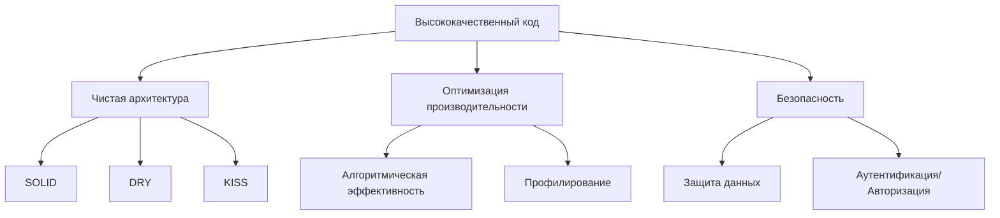

<div align="center">
  
  
  
  <div style="display: inline-block;">
    
    <br/>
    
  </div>
  
  <br/>
  
  [](https://github.com/YALOKGARua)
  [](https://github.com/YALOKGARua?tab=repositories)
  

</div>

<hr>

<div align="center">
  
</div>

<details open>
<summary><h2>📋 Обо мне</h2></summary>

<p align="center">
  
  
  ```typescript
  class SoftwareEngineer {
    name: string = "YALOKGARua";
    role: string = "Senior Software Engineer";
    location: string = "World";
    languages: string[] = ["ru_RU", "en_US"];
    
    currentFocus: string = "Building scalable 
      systems with optimal architecture";
    
    get skills(): Record<string, string[]> {
      return {
        languages: [
          "C/C++", "C#", "Python", "Rust",
          "JavaScript", "TypeScript"
        ],
        architectures: [
          "Microservices", "Event Driven",
          "Serverless", "MVC", "MVVM"
        ],
        engineering: [
          "System Design", "Performance Optimization",
          "Software Architecture", "Algorithms"
        ]
      };
    }
    
    challenge(): string {
      return "Transforming complex requirements 
        into elegant software solutions";
    }
  }
  ```
</p>

<br>

<div align="center">
  <a href="https://discord.gg/HUhFudC4qn">
    
  </a>
  <a href="https://instagram.com/yalokgar">
    
  </a>
  <a href="https://linkedin.com/in/yalokgar">
    
  </a>
  <a href="https://stackoverflow.com/users/user:30341921">
    
  </a>
  <a href="mailto:yalokgar@gmail.com">
    
  </a>
</div>
</details>

<details open>
<summary><h2>🛠️ Инженерный арсенал</h2></summary>

<h3>Языки программирования</h3>

<div align="center">
  <br>
  <i>C • C++ • C# • JavaScript • TypeScript • Python • Rust • Lua • Ruby • HTML • CSS • WebAssembly</i>
</div>

<h3>Фреймворки и библиотеки</h3>

<div align="center">
  <br>
  <i>.NET • Node.js • React • Vue • Angular • Bootstrap • jQuery • Three.js • Express • TensorFlow</i>
</div>

<h3>Базы данных и облачные технологии</h3>

<div align="center">
  <br>
  <i>MySQL • PostgreSQL • SQLite • MongoDB • Redis • AWS • Azure • Firebase • Docker • Kubernetes</i>
</div>

<h3>Инструменты и DevOps</h3>

<div align="center">
  <br>
  <i>Git • GitHub • GitLab • CMake • PowerShell • Bash • Vim • VSCode • Visual Studio • Figma</i>
</div>

<h3>Игровая разработка</h3>

<div align="center">
  <br>
  <i>Unity • Unreal Engine • Godot • Blender</i>
</div>
</details>

<details open>
<summary><h2>🧪 Проекты</h2></summary>
<div align="center">
  <table>
    <tr>
      <td width="50%">
        <h3 align="center">Project 1</h3>
        <div align="center">
          <a href="https://github.com/YALOKGARua/project1" target="_blank">
            
          </a>
          <p>
            <a href="https://github.com/YALOKGARua/project1" target="_blank">
              
            </a>
            <a href="https://project1-demo.com" target="_blank">
              
            </a>
          </p>
          <p><strong>C++, Rust, OpenGL</strong> — High-performance rendering system with advanced optimization techniques</p>
        </div>
      </td>
      <td width="50%">
        <h3 align="center">Project 2</h3>
        <div align="center">
          <a href="https://github.com/YALOKGARua/project2" target="_blank">
            
          </a>
          <p>
            <a href="https://github.com/YALOKGARua/project2" target="_blank">
              
            </a>
            <a href="https://project2-demo.com" target="_blank">
              
            </a>
          </p>
          <p><strong>TypeScript, Node.js, React</strong> — Scalable microservice architecture with event-driven communication</p>
        </div>
      </td>
    </tr>
    <tr>
      <td width="50%">
        <h3 align="center">Project 3</h3>
        <div align="center">
          <a href="https://github.com/YALOKGARua/project3" target="_blank">
            
          </a>
          <p>
            <a href="https://github.com/YALOKGARua/project3" target="_blank">
              
            </a>
            <a href="https://project3-demo.com" target="_blank">
              
            </a>
          </p>
          <p><strong>C#, .NET, Azure</strong> — Enterprise-grade cloud solution with advanced security implementations</p>
        </div>
      </td>
      <td width="50%">
        <h3 align="center">Project 4</h3>
        <div align="center">
          <a href="https://github.com/YALOKGARua/project4" target="_blank">
            
          </a>
          <p>
            <a href="https://github.com/YALOKGARua/project4" target="_blank">
              
            </a>
            <a href="https://project4-demo.com" target="_blank">
              
            </a>
          </p>
          <p><strong>Unreal Engine, C++</strong> — Game development project featuring advanced rendering techniques and AI systems</p>
        </div>
      </td>
    </tr>
  </table>
</div>
</details>

<details open>
<summary><h2>📊 GitHub статистика</h2></summary>
<div align="center">
  
</div>

<div align="center">
  
  
</div>

<div align="center">
  
</div>

<div align="center">
  <a href="https://github.com/YALOKGARua">
    
  </a>
</div>

<div align="center">
  
</div>
</details>

<details>
<summary><h2>⚡ Технологии и платформы</h2></summary>

<h3>Аппаратные платформы</h3>
<div align="center">
  
  
  
  
</div>

<h3>Игровые платформы</h3>
<div align="center">
  
  
  
  
  
  
  
  
</div>
</details>

<details>
<summary><h2>💼 Рабочий процесс</h2></summary>

<h3>Методологии</h3>

<div align="center">
  
  
  
  
  
  
</div>

<h3>Мои принципы</h3>


```mermaid
graph TD
    A[Высококачественный код] --> B[Чистая архитектура]
    A --> C[Оптимизация производительности]
    A --> D[Безопасность]
    
    B --> E[SOLID]
    B --> F[DRY]
    B --> G[KISS]
    
    C --> H[Алгоритмическая эффективность]
    C --> I[Профилирование]
    
    D --> J[Защита данных]
    D --> K[Аутентификация/Авторизация]
```

<h3>Повседневные инструменты</h3>

<div align="center">
  
  
  
  
  
  
</div>
</details>

<div align="center">
  <a href="https://github.com/YALOKGARua">
    
  </a>
</div>

